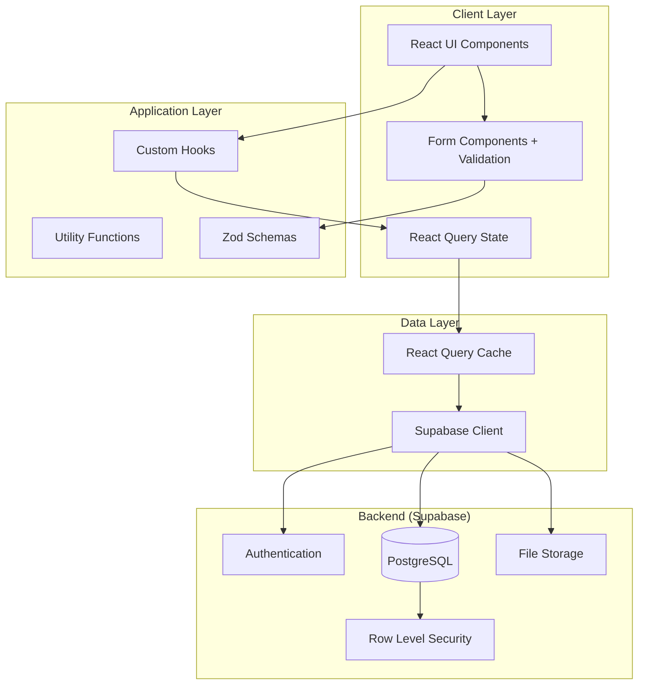
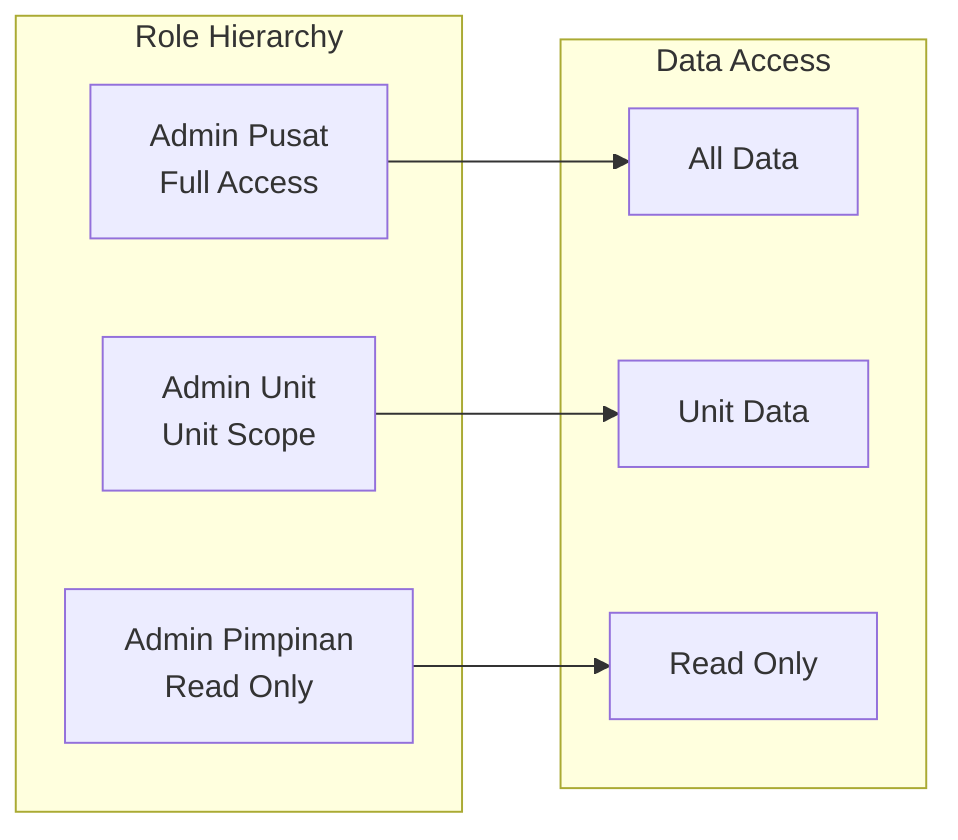

# Design Document: SIMPEL Application Improvement Roadmap

## Overview

This design document outlines the technical architecture and implementation strategy for enhancing the SIMPEL (Sistem Manajemen Pegawai Lavotas) application. The improvements are prioritized across 4 phases, with this document providing high-level design for all requirements and detailed low-level design for Phase 1 (High Priority) requirements.

### Phase 1 Requirements (Detailed Design)
- Requirement 1: Enhanced Data Validation and Error Prevention
- Requirement 3: Advanced Search and Filtering
- Requirement 11: Mobile-Responsive Optimization
- Requirement 12: Performance Optimization and Caching

### Design Goals
1. Maintain backward compatibility with existing data and RLS policies
2. Enhance user experience through better validation and feedback
3. Improve application performance and responsiveness
4. Enable mobile-first access for field administrators
5. Establish patterns for future feature development

### Technology Stack
- **Frontend**: React 18.3 + TypeScript 5.8 + Vite 5.4
- **UI Framework**: shadcn-ui (Radix UI) + Tailwind CSS 3.4
- **State Management**: React Query 5.83 (TanStack Query)
- **Form Management**: React Hook Form 7.61 + Zod 3.25
- **Backend**: Supabase (PostgreSQL + Auth + Storage)
- **Deployment**: Vercel

## Architecture

### System Architecture Overview



### Architectural Principles

1. **Separation of Concerns**: Clear boundaries between UI, business logic, and data access
2. **Component Reusability**: Shared components for common patterns (forms, tables, dialogs)
3. **Type Safety**: Comprehensive TypeScript types for all data structures
4. **Security First**: All data access controlled by Supabase RLS policies
5. **Performance Optimization**: Caching, lazy loading, and code splitting
6. **Mobile Responsive**: Mobile-first design with progressive enhancement

### Multi-Role Architecture

The application supports three distinct roles with different permissions:



**Role Permissions**:
- **Admin Pusat**: Full CRUD access to all data across all units
- **Admin Unit**: CRUD access limited to their own unit (enforced by RLS)
- **Admin Pimpinan**: Read-only access to all data for reporting and oversight

## Components and Interfaces

### Phase 1 Component Architecture

#### 1. Enhanced Validation System (Requirement 1)

**Validation Schema Structure**:

```typescript
// src/lib/validation/employee-schemas.ts
import { z } from 'zod';

// Base validation schemas
const nipSchema = z.string()
  .length(18, 'NIP harus 18 digit')
  .regex(/^\d{18}$/, 'NIP hanya boleh berisi angka');

const nikSchema = z.string()
  .length(16, 'NIK harus 16 digit')
  .regex(/^\d{16}$/, 'NIK hanya boleh berisi angka');

const birthDateSchema = z.date()
  .max(new Date(), 'Tanggal lahir tidak boleh di masa depan');

const joinDateSchema = z.date();

// Employee validation schema with cross-field validation
export const employeeSchema = z.object({
  nip: nipSchema,
  nik: nikSchema,
  nama: z.string().min(1, 'Nama wajib diisi'),
  tanggal_lahir: birthDateSchema,
  tanggal_masuk: joinDateSchema,
  // ... other fields
}).refine(
  (data) => data.tanggal_masuk >= data.tanggal_lahir,
  {
    message: 'Tanggal masuk tidak boleh sebelum tanggal lahir',
    path: ['tanggal_masuk'],
  }
);
```

**Validation Hook**:

```typescript
// src/hooks/useEmployeeValidation.ts
export function useEmployeeValidation() {
  const checkDuplicateNIP = async (nip: string, excludeId?: string) => {
    const { data } = await supabase
      .from('employees')
      .select('id, nama')
      .eq('nip', nip)
      .neq('id', excludeId || '')
      .maybeSingle();
    
    return data ? `NIP sudah digunakan oleh ${data.nama}` : null;
  };
  
  const checkDuplicateNIK = async (nik: string, excludeId?: string) => {
    // Similar implementation
  };
  
  return { checkDuplicateNIP, checkDuplicateNIK };
}
```

**Form Component Integration**:

```typescript
// Enhanced EmployeeFormModal with real-time validation
const form = useForm({
  resolver: zodResolver(employeeSchema),
  mode: 'onChange', // Real-time validation
});

// Async validation for duplicates
const validateNIP = async (value: string) => {
  const error = await checkDuplicateNIP(value, employee?.id);
  if (error) {
    form.setError('nip', { message: error });
  }
};
```

**Component Structure**:
- `src/lib/validation/employee-schemas.ts` - Zod validation schemas
- `src/lib/validation/non-asn-schemas.ts` - Non-ASN specific schemas
- `src/hooks/useEmployeeValidation.ts` - Validation logic hook
- `src/components/ui/form-field-error.tsx` - Reusable error display component

#### 2. Advanced Search and Filtering (Requirement 3)

**Search State Management**:

```typescript
// src/hooks/useEmployeeSearch.ts
interface SearchFilters {
  query: string;
  rankGroup?: string;
  positionType?: string;
  joinYearRange?: [number, number];
  educationLevel?: string;
  gender?: string;
  religion?: string;
  department?: string;
}

export function useEmployeeSearch() {
  const [filters, setFilters] = useState<SearchFilters>({
    query: '',
  });
  
  const debouncedQuery = useDebounce(filters.query, 300);
  
  const buildQuery = () => {
    let query = supabase
      .from('employees')
      .select('*');
    
    // Multi-field search
    if (debouncedQuery) {
      query = query.or(`
        nip.ilike.%${debouncedQuery}%,
        nik.ilike.%${debouncedQuery}%,
        nama.ilike.%${debouncedQuery}%,
        jabatan.ilike.%${debouncedQuery}%,
        unit_kerja.ilike.%${debouncedQuery}%
      `);
    }
    
    // Apply filters with AND logic
    if (filters.rankGroup) {
      query = query.eq('golongan', filters.rankGroup);
    }
    
    // ... other filters
    
    return query;
  };
  
  return { filters, setFilters, buildQuery };
}
```

**Filter Component**:

```typescript
// src/components/employees/EmployeeFilters.tsx
export function EmployeeFilters({ filters, onChange, onClear }) {
  const activeFilters = getActiveFilters(filters);
  
  return (
    <div className="space-y-4">
      {/* Search input */}
      <Input
        placeholder="Cari NIP, NIK, nama, jabatan, atau unit kerja..."
        value={filters.query}
        onChange={(e) => onChange({ ...filters, query: e.target.value })}
      />
      
      {/* Filter dropdowns */}
      <div className="flex flex-wrap gap-2">
        <Select
          value={filters.rankGroup}
          onValueChange={(value) => onChange({ ...filters, rankGroup: value })}
        >
          <SelectTrigger>
            <SelectValue placeholder="Golongan" />
          </SelectTrigger>
          <SelectContent>
            {RANK_GROUPS.map(rank => (
              <SelectItem key={rank} value={rank}>{rank}</SelectItem>
            ))}
          </SelectContent>
        </Select>
        
        {/* Other filter selects */}
      </div>
      
      {/* Active filter badges */}
      {activeFilters.length > 0 && (
        <div className="flex flex-wrap gap-2">
          {activeFilters.map(filter => (
            <Badge key={filter.key} variant="secondary">
              {filter.label}
              <X onClick={() => removeFilter(filter.key)} />
            </Badge>
          ))}
          <Button variant="ghost" size="sm" onClick={onClear}>
            Hapus Semua Filter
          </Button>
        </div>
      )}
    </div>
  );
}
```

**Saved Filters Feature**:

```typescript
// src/hooks/useSavedFilters.ts
export function useSavedFilters() {
  const { user } = useAuth();
  
  const { data: savedFilters } = useQuery({
    queryKey: ['saved-filters', user?.id],
    queryFn: async () => {
      const { data } = await supabase
        .from('saved_filters')
        .select('*')
        .eq('user_id', user?.id);
      return data;
    },
  });
  
  const saveFilter = async (name: string, filters: SearchFilters) => {
    await supabase.from('saved_filters').insert({
      user_id: user?.id,
      name,
      filters,
    });
  };
  
  return { savedFilters, saveFilter };
}
```

**Component Structure**:
- `src/hooks/useEmployeeSearch.ts` - Search and filter logic
- `src/hooks/useSavedFilters.ts` - Saved filter management
- `src/components/employees/EmployeeFilters.tsx` - Filter UI component
- `src/components/employees/FilterBadges.tsx` - Active filter display
- `src/lib/utils/debounce.ts` - Debounce utility

#### 3. Mobile-Responsive Optimization (Requirement 11)

**Responsive Layout Strategy**:

```typescript
// src/hooks/use-mobile.tsx (already exists, enhance)
export function useMobile() {
  const [isMobile, setIsMobile] = useState(false);
  const [isTablet, setIsTablet] = useState(false);
  
  useEffect(() => {
    const checkDevice = () => {
      setIsMobile(window.innerWidth < 768);
      setIsTablet(window.innerWidth >= 768 && window.innerWidth < 1024);
    };
    
    checkDevice();
    window.addEventListener('resize', checkDevice);
    return () => window.removeEventListener('resize', checkDevice);
  }, []);
  
  return { isMobile, isTablet, isDesktop: !isMobile && !isTablet };
}
```

**Responsive Table Component**:

```typescript
// src/components/employees/ResponsiveEmployeeList.tsx
export function ResponsiveEmployeeList({ employees }) {
  const { isMobile } = useMobile();
  
  if (isMobile) {
    return <EmployeeCardList employees={employees} />;
  }
  
  return <EmployeeTable employees={employees} />;
}

// Mobile card view
function EmployeeCardList({ employees }) {
  return (
    <div className="space-y-3">
      {employees.map(employee => (
        <Card key={employee.id} className="p-4">
          <div className="flex justify-between items-start">
            <div className="space-y-1">
              <h3 className="font-semibold">{employee.nama}</h3>
              <p className="text-sm text-muted-foreground">{employee.nip}</p>
              <p className="text-sm">{employee.jabatan}</p>
            </div>
            <DropdownMenu>
              <DropdownMenuTrigger asChild>
                <Button variant="ghost" size="icon">
                  <MoreVertical className="h-4 w-4" />
                </Button>
              </DropdownMenuTrigger>
              <DropdownMenuContent align="end">
                <DropdownMenuItem>Detail</DropdownMenuItem>
                <DropdownMenuItem>Edit</DropdownMenuItem>
                <DropdownMenuItem>Hapus</DropdownMenuItem>
              </DropdownMenuContent>
            </DropdownMenu>
          </div>
        </Card>
      ))}
    </div>
  );
}
```

**Mobile Navigation**:

```typescript
// src/components/layout/MobileNav.tsx
export function MobileNav() {
  const [isOpen, setIsOpen] = useState(false);
  
  return (
    <>
      <Button
        variant="ghost"
        size="icon"
        className="md:hidden"
        onClick={() => setIsOpen(true)}
      >
        <Menu className="h-6 w-6" />
      </Button>
      
      <Sheet open={isOpen} onOpenChange={setIsOpen}>
        <SheetContent side="left" className="w-[280px]">
          <nav className="flex flex-col space-y-2">
            <NavLink to="/dashboard">Dashboard</NavLink>
            <NavLink to="/employees">Data Pegawai</NavLink>
            {/* Other nav items */}
          </nav>
        </SheetContent>
      </Sheet>
    </>
  );
}
```

**Mobile Form Optimization**:

```typescript
// Enhanced form fields for mobile
<FormField
  control={form.control}
  name="tanggal_lahir"
  render={({ field }) => (
    <FormItem>
      <FormLabel>Tanggal Lahir</FormLabel>
      <FormControl>
        {isMobile ? (
          <Input
            type="date"
            {...field}
            value={field.value ? format(field.value, 'yyyy-MM-dd') : ''}
          />
        ) : (
          <DatePicker
            date={field.value}
            onSelect={field.onChange}
          />
        )}
      </FormControl>
    </FormItem>
  )}
/>
```

**Component Structure**:
- `src/components/employees/ResponsiveEmployeeList.tsx` - Adaptive list/card view
- `src/components/employees/EmployeeCardList.tsx` - Mobile card layout
- `src/components/layout/MobileNav.tsx` - Mobile navigation drawer
- `src/components/layout/ResponsiveLayout.tsx` - Responsive layout wrapper
- `src/components/ui/bottom-sheet.tsx` - Mobile bottom sheet component

#### 4. Performance Optimization and Caching (Requirement 12)

**React Query Configuration**:

```typescript
// src/lib/query-client.ts
export const queryClient = new QueryClient({
  defaultOptions: {
    queries: {
      staleTime: 5 * 60 * 1000, // 5 minutes
      cacheTime: 10 * 60 * 1000, // 10 minutes
      refetchOnWindowFocus: false,
      retry: 1,
    },
  },
});
```

**Optimized Data Fetching**:

```typescript
// src/hooks/useEmployees.ts
export function useEmployees(filters: SearchFilters) {
  return useQuery({
    queryKey: ['employees', filters],
    queryFn: async () => {
      const query = buildEmployeeQuery(filters);
      const { data, error } = await query;
      if (error) throw error;
      return data;
    },
    staleTime: 5 * 60 * 1000,
    // Prefetch next page
    onSuccess: (data) => {
      if (data.length === PAGE_SIZE) {
        queryClient.prefetchQuery({
          queryKey: ['employees', { ...filters, page: filters.page + 1 }],
          queryFn: () => fetchNextPage(filters),
        });
      }
    },
  });
}
```

**Virtual Scrolling for Large Lists**:

```typescript
// src/components/employees/VirtualEmployeeTable.tsx
import { useVirtualizer } from '@tanstack/react-virtual';

export function VirtualEmployeeTable({ employees }) {
  const parentRef = useRef<HTMLDivElement>(null);
  
  const virtualizer = useVirtualizer({
    count: employees.length,
    getScrollElement: () => parentRef.current,
    estimateSize: () => 60, // Row height
    overscan: 10, // Render 10 extra rows
  });
  
  return (
    <div ref={parentRef} className="h-[600px] overflow-auto">
      <div
        style={{
          height: `${virtualizer.getTotalSize()}px`,
          position: 'relative',
        }}
      >
        {virtualizer.getVirtualItems().map(virtualRow => (
          <div
            key={virtualRow.index}
            style={{
              position: 'absolute',
              top: 0,
              left: 0,
              width: '100%',
              height: `${virtualRow.size}px`,
              transform: `translateY(${virtualRow.start}px)`,
            }}
          >
            <EmployeeRow employee={employees[virtualRow.index]} />
          </div>
        ))}
      </div>
    </div>
  );
}
```

**Lazy Loading and Code Splitting**:

```typescript
// src/App.tsx - Enhanced with lazy loading
import { lazy, Suspense } from 'react';

const Dashboard = lazy(() => import('./pages/Dashboard'));
const Employees = lazy(() => import('./pages/Employees'));
const Import = lazy(() => import('./pages/Import'));
const PetaJabatan = lazy(() => import('./pages/PetaJabatan'));

function App() {
  return (
    <Suspense fallback={<LoadingSpinner />}>
      <Routes>
        <Route path="/dashboard" element={<Dashboard />} />
        <Route path="/employees" element={<Employees />} />
        {/* Other routes */}
      </Routes>
    </Suspense>
  );
}
```

**Skeleton Loaders**:

```typescript
// src/components/ui/skeleton-table.tsx
export function SkeletonTable({ rows = 10 }) {
  return (
    <div className="space-y-2">
      {Array.from({ length: rows }).map((_, i) => (
        <Skeleton key={i} className="h-12 w-full" />
      ))}
    </div>
  );
}
```

**Component Structure**:
- `src/lib/query-client.ts` - React Query configuration
- `src/hooks/useEmployees.ts` - Optimized employee data fetching
- `src/components/employees/VirtualEmployeeTable.tsx` - Virtual scrolling table
- `src/components/ui/skeleton-table.tsx` - Loading skeletons
- `src/lib/utils/debounce.ts` - Debounce utility for search

## Data Models

### New Database Tables for Phase 1

#### 1. Saved Filters Table

```sql
CREATE TABLE saved_filters (
  id UUID PRIMARY KEY DEFAULT uuid_generate_v4(),
  user_id UUID NOT NULL REFERENCES auth.users(id) ON DELETE CASCADE,
  name TEXT NOT NULL,
  filters JSONB NOT NULL,
  created_at TIMESTAMPTZ DEFAULT NOW(),
  updated_at TIMESTAMPTZ DEFAULT NOW()
);

CREATE INDEX idx_saved_filters_user_id ON saved_filters(user_id);

-- RLS Policies
ALTER TABLE saved_filters ENABLE ROW LEVEL SECURITY;

CREATE POLICY "Users can view own saved filters"
  ON saved_filters FOR SELECT
  USING (auth.uid() = user_id);

CREATE POLICY "Users can create own saved filters"
  ON saved_filters FOR INSERT
  WITH CHECK (auth.uid() = user_id);

CREATE POLICY "Users can update own saved filters"
  ON saved_filters FOR UPDATE
  USING (auth.uid() = user_id);

CREATE POLICY "Users can delete own saved filters"
  ON saved_filters FOR DELETE
  USING (auth.uid() = user_id);
```

#### 2. User Preferences Table

```sql
CREATE TABLE user_preferences (
  id UUID PRIMARY KEY DEFAULT uuid_generate_v4(),
  user_id UUID NOT NULL REFERENCES auth.users(id) ON DELETE CASCADE,
  preferences JSONB NOT NULL DEFAULT '{}',
  created_at TIMESTAMPTZ DEFAULT NOW(),
  updated_at TIMESTAMPTZ DEFAULT NOW(),
  UNIQUE(user_id)
);

-- RLS Policies
ALTER TABLE user_preferences ENABLE ROW LEVEL SECURITY;

CREATE POLICY "Users can view own preferences"
  ON user_preferences FOR SELECT
  USING (auth.uid() = user_id);

CREATE POLICY "Users can insert own preferences"
  ON user_preferences FOR INSERT
  WITH CHECK (auth.uid() = user_id);

CREATE POLICY "Users can update own preferences"
  ON user_preferences FOR UPDATE
  USING (auth.uid() = user_id);
```

### Enhanced Existing Tables

#### Add Indexes for Performance

```sql
-- Indexes for employee search
CREATE INDEX idx_employees_nip ON employees(nip);
CREATE INDEX idx_employees_nik ON employees(nik);
CREATE INDEX idx_employees_nama ON employees USING gin(nama gin_trgm_ops);
CREATE INDEX idx_employees_jabatan ON employees USING gin(jabatan gin_trgm_ops);
CREATE INDEX idx_employees_unit_kerja ON employees(unit_kerja);
CREATE INDEX idx_employees_golongan ON employees(golongan);
CREATE INDEX idx_employees_jenis_jabatan ON employees(jenis_jabatan);
CREATE INDEX idx_employees_tanggal_masuk ON employees(tanggal_masuk);

-- Enable trigram extension for fuzzy search
CREATE EXTENSION IF NOT EXISTS pg_trgm;
```

### TypeScript Type Definitions

```typescript
// src/types/database.ts

export interface SavedFilter {
  id: string;
  user_id: string;
  name: string;
  filters: SearchFilters;
  created_at: string;
  updated_at: string;
}

export interface UserPreferences {
  id: string;
  user_id: string;
  preferences: {
    dashboard_layout?: any[];
    default_filters?: SearchFilters;
    items_per_page?: number;
    theme?: 'light' | 'dark' | 'system';
  };
  created_at: string;
  updated_at: string;
}

export interface SearchFilters {
  query?: string;
  rankGroup?: string;
  positionType?: string;
  joinYearRange?: [number, number];
  educationLevel?: string;
  gender?: string;
  religion?: string;
  department?: string;
}

export interface ValidationError {
  field: string;
  message: string;
  type: 'format' | 'duplicate' | 'required' | 'logic';
}
```


## Correctness Properties

*A property is a characteristic or behavior that should hold true across all valid executions of a system—essentially, a formal statement about what the system should do. Properties serve as the bridge between human-readable specifications and machine-verifiable correctness guarantees.*

### Property Reflection

After analyzing all acceptance criteria, I identified the following redundancies and consolidations:

**Consolidated Properties**:
- Properties 1.1 and 1.2 (NIP and NIK format validation) can be combined into a single property about ID format validation
- Properties 1.3 and 1.4 (NIP and NIK duplicate validation) can be combined into a single property about ID uniqueness validation
- Properties 3.3-3.8 (various filter UI displays) are all examples of the same pattern and don't need separate properties
- Properties 11.2, 11.3, 11.5, 11.7 (various mobile layout behaviors) can be combined into a general responsive layout property

**Eliminated Redundancies**:
- Property 12.10 (database indexes) is not a testable functional requirement
- Property 12.12 (code splitting) is a build-time configuration, not a runtime property

### Requirement 1: Enhanced Data Validation and Error Prevention

#### Property 1: ID Format Validation

*For any* employee ID field (NIP or NIK), when an invalid format is provided (wrong length or non-numeric characters), the validation system should reject the input and display a specific error message explaining the correct format (18 digits for NIP, 16 digits for NIK).

**Validates: Requirements 1.1, 1.2**

#### Property 2: ID Uniqueness Validation

*For any* employee ID field (NIP or NIK), when attempting to save a value that already exists in the database, the validation system should prevent the save operation and display an error message including the name of the existing employee with that ID.

**Validates: Requirements 1.3, 1.4**

#### Property 3: Future Date Rejection

*For any* birth date input, if the date is in the future (after the current date), the validation system should reject the input and display an error message.

**Validates: Requirements 1.5**

#### Property 4: Date Logic Validation

*For any* employee record with both birth date and join date, if the join date is before the birth date, the validation system should reject the input and display an error message.

**Validates: Requirements 1.6**

#### Property 5: Indonesian Error Messages

*For any* validation error generated by the system, the error message should be displayed in Indonesian language.

**Validates: Requirements 1.9**

#### Property 6: Real-time Validation Feedback

*For any* form field with validation errors, when the field value changes from invalid to valid, the error message should be removed immediately without requiring form submission.

**Validates: Requirements 1.10**

### Requirement 3: Advanced Search and Filtering

#### Property 7: Multi-field Search

*For any* search query string, the search results should include employees where the query matches any of the following fields: NIP, NIK, name, position, or department.

**Validates: Requirements 3.1**

#### Property 8: Filter Combination Logic

*For any* set of multiple active filters, the search results should include only employees that match ALL active filters (AND logic).

**Validates: Requirements 3.2**

#### Property 9: Filter Reset

*For any* filter state with one or more active filters, clicking "Clear All Filters" should reset all filters to their default (empty) state and refresh the employee list.

**Validates: Requirements 3.9**

#### Property 10: Active Filter Display

*For any* set of active filters, the UI should display a badge for each active filter showing which filters are currently applied.

**Validates: Requirements 3.10**

#### Property 11: Individual Filter Removal

*For any* active filter badge, clicking the badge should remove only that specific filter while keeping other filters active.

**Validates: Requirements 3.11**

#### Property 12: Saved Filter Round-trip

*For any* filter configuration, saving the configuration and then loading it should restore the exact same filter state.

**Validates: Requirements 3.12**

### Requirement 11: Mobile-Responsive Optimization

#### Property 13: Responsive Layout Switching

*For any* viewport width below 768px (mobile breakpoint), the application should display mobile-optimized layouts including card-based lists, vertically stacked forms, and vertically stacked dashboard widgets.

**Validates: Requirements 11.1, 11.2, 11.3, 11.5, 11.7**

#### Property 14: Mobile Input Types

*For any* form input field on mobile viewports, the system should use native mobile input types (date picker for dates, number pad for numeric fields).

**Validates: Requirements 11.8**

#### Property 15: Mobile Action Menus

*For any* action menu on mobile viewports, the system should display the menu as a bottom sheet instead of a dropdown.

**Validates: Requirements 11.10**

#### Property 16: Mobile File Upload

*For any* file upload field on mobile devices, the system should support both file selection and camera capture.

**Validates: Requirements 11.11**

#### Property 17: Touch Target Sizes

*For all* interactive elements (buttons, links, form controls), the touch target size should be at least 44x44 pixels to ensure adequate touch accessibility.

**Validates: Requirements 11.12**

### Requirement 12: Performance Optimization and Caching

#### Property 18: Cache Freshness

*For any* previously fetched data, if the data is less than 5 minutes old, navigating to the page should load data from cache instead of making a new API request.

**Validates: Requirements 12.1**

#### Property 19: Cache Invalidation

*For any* data update operation (create, update, delete), the system should automatically invalidate all relevant cached queries.

**Validates: Requirements 12.2**

#### Property 20: Virtual Scrolling

*For any* employee list with more than 100 items, the system should render only the visible rows in the DOM using virtual scrolling.

**Validates: Requirements 12.3**

#### Property 21: Progressive Widget Loading

*For any* dashboard page load, critical widgets should be loaded and displayed before secondary widgets.

**Validates: Requirements 12.4**

#### Property 22: Search Debouncing

*For any* sequence of search input changes within 300ms, the system should make only one API call after the last change (debouncing).

**Validates: Requirements 12.5**

#### Property 23: Lazy Image Loading

*For any* image or file element, the resource should only be loaded when the element enters the viewport.

**Validates: Requirements 12.6**

#### Property 24: Stale-While-Revalidate

*For any* data fetch operation, if stale cached data exists, the system should display the stale data immediately while fetching fresh data in the background.

**Validates: Requirements 12.7**

#### Property 25: Loading State Display

*For any* page or component in loading state, the system should display skeleton loaders instead of blank screens.

**Validates: Requirements 12.8**

#### Property 26: Background Export Processing

*For any* large data export request (more than 1000 records), the system should process the export in the background and notify the user when complete, without blocking the UI.

**Validates: Requirements 12.9**

#### Property 27: Next Page Prefetching

*For any* paginated list, when viewing page N, the system should prefetch page N+1 in the background for instant navigation.

**Validates: Requirements 12.11**


## Error Handling

### Error Handling Strategy

The application implements a comprehensive error handling strategy across all layers:

#### 1. Validation Errors (Client-Side)

**Zod Schema Validation**:
```typescript
try {
  const validatedData = employeeSchema.parse(formData);
  // Proceed with save
} catch (error) {
  if (error instanceof z.ZodError) {
    // Display field-specific errors
    error.errors.forEach(err => {
      form.setError(err.path[0], {
        type: 'validation',
        message: err.message,
      });
    });
  }
}
```

**Async Validation Errors**:
```typescript
const validateUniqueness = async (field: string, value: string) => {
  try {
    const exists = await checkDuplicate(field, value);
    if (exists) {
      return `${field} sudah digunakan oleh ${exists.nama}`;
    }
    return null;
  } catch (error) {
    console.error('Validation error:', error);
    return 'Gagal memvalidasi data. Silakan coba lagi.';
  }
};
```

#### 2. API Errors (Supabase)

**Query Error Handling**:
```typescript
export function useEmployees(filters: SearchFilters) {
  return useQuery({
    queryKey: ['employees', filters],
    queryFn: async () => {
      const { data, error } = await supabase
        .from('employees')
        .select('*')
        .match(filters);
      
      if (error) {
        throw new Error(translateSupabaseError(error));
      }
      
      return data;
    },
    onError: (error) => {
      toast.error('Gagal memuat data pegawai', {
        description: error.message,
      });
    },
  });
}
```

**Mutation Error Handling**:
```typescript
export function useCreateEmployee() {
  const queryClient = useQueryClient();
  
  return useMutation({
    mutationFn: async (employee: Employee) => {
      const { data, error } = await supabase
        .from('employees')
        .insert(employee)
        .select()
        .single();
      
      if (error) {
        throw new Error(translateSupabaseError(error));
      }
      
      return data;
    },
    onSuccess: () => {
      queryClient.invalidateQueries(['employees']);
      toast.success('Pegawai berhasil ditambahkan');
    },
    onError: (error) => {
      toast.error('Gagal menambahkan pegawai', {
        description: error.message,
      });
    },
  });
}
```

#### 3. Network Errors

**Retry Strategy**:
```typescript
export const queryClient = new QueryClient({
  defaultOptions: {
    queries: {
      retry: (failureCount, error) => {
        // Don't retry on 4xx errors
        if (error.message.includes('4')) return false;
        // Retry up to 3 times for network errors
        return failureCount < 3;
      },
      retryDelay: (attemptIndex) => {
        // Exponential backoff: 1s, 2s, 4s
        return Math.min(1000 * 2 ** attemptIndex, 30000);
      },
    },
  },
});
```

**Offline Detection**:
```typescript
export function useOnlineStatus() {
  const [isOnline, setIsOnline] = useState(navigator.onLine);
  
  useEffect(() => {
    const handleOnline = () => {
      setIsOnline(true);
      toast.success('Koneksi internet tersambung kembali');
      queryClient.refetchQueries();
    };
    
    const handleOffline = () => {
      setIsOnline(false);
      toast.error('Koneksi internet terputus', {
        description: 'Beberapa fitur mungkin tidak tersedia',
      });
    };
    
    window.addEventListener('online', handleOnline);
    window.addEventListener('offline', handleOffline);
    
    return () => {
      window.removeEventListener('online', handleOnline);
      window.removeEventListener('offline', handleOffline);
    };
  }, []);
  
  return isOnline;
}
```

#### 4. Permission Errors

**RLS Policy Violations**:
```typescript
function translateSupabaseError(error: PostgrestError): string {
  // RLS policy violation
  if (error.code === '42501') {
    return 'Anda tidak memiliki izin untuk melakukan operasi ini';
  }
  
  // Unique constraint violation
  if (error.code === '23505') {
    if (error.message.includes('nip')) {
      return 'NIP sudah terdaftar';
    }
    if (error.message.includes('nik')) {
      return 'NIK sudah terdaftar';
    }
    return 'Data sudah ada dalam sistem';
  }
  
  // Foreign key violation
  if (error.code === '23503') {
    return 'Data terkait tidak ditemukan';
  }
  
  // Default error
  return error.message || 'Terjadi kesalahan. Silakan coba lagi.';
}
```

#### 5. Error Boundaries

**React Error Boundary**:
```typescript
// src/components/ErrorBoundary.tsx
export class ErrorBoundary extends React.Component<
  { children: ReactNode },
  { hasError: boolean; error: Error | null }
> {
  constructor(props) {
    super(props);
    this.state = { hasError: false, error: null };
  }
  
  static getDerivedStateFromError(error: Error) {
    return { hasError: true, error };
  }
  
  componentDidCatch(error: Error, errorInfo: ErrorInfo) {
    console.error('Error caught by boundary:', error, errorInfo);
    // Log to error tracking service (e.g., Sentry)
  }
  
  render() {
    if (this.state.hasError) {
      return (
        <div className="flex min-h-screen items-center justify-center p-4">
          <Card className="max-w-md">
            <CardHeader>
              <CardTitle>Terjadi Kesalahan</CardTitle>
              <CardDescription>
                Aplikasi mengalami kesalahan yang tidak terduga
              </CardDescription>
            </CardHeader>
            <CardContent>
              <p className="text-sm text-muted-foreground mb-4">
                {this.state.error?.message}
              </p>
              <Button onClick={() => window.location.reload()}>
                Muat Ulang Halaman
              </Button>
            </CardContent>
          </Card>
        </div>
      );
    }
    
    return this.props.children;
  }
}
```

### Error Message Guidelines

1. **Be Specific**: Clearly state what went wrong
2. **Be Actionable**: Suggest how to fix the problem
3. **Use Indonesian**: All user-facing messages in Indonesian
4. **Be Consistent**: Use consistent terminology across the app
5. **Be Helpful**: Provide context and next steps

**Examples**:
- ❌ "Error"
- ✅ "NIP harus 18 digit angka"

- ❌ "Invalid input"
- ✅ "Tanggal masuk tidak boleh sebelum tanggal lahir"

- ❌ "Database error"
- ✅ "NIP sudah digunakan oleh Ahmad Suryadi"

## Testing Strategy

### Dual Testing Approach

The application requires both unit tests and property-based tests for comprehensive coverage:

**Unit Tests**: Focus on specific examples, edge cases, and integration points
**Property Tests**: Verify universal properties across all inputs through randomization

### Testing Stack

- **Test Framework**: Vitest (fast, Vite-native)
- **Property-Based Testing**: fast-check (JavaScript/TypeScript PBT library)
- **React Testing**: @testing-library/react
- **E2E Testing**: Playwright (for critical user flows)

### Property-Based Testing Configuration

All property tests must:
- Run minimum 100 iterations per test
- Reference the design document property
- Use tag format: `Feature: application-improvement-roadmap, Property {number}: {property_text}`

**Example Property Test**:

```typescript
// src/lib/validation/__tests__/employee-validation.property.test.ts
import { describe, it, expect } from 'vitest';
import * as fc from 'fast-check';
import { employeeSchema } from '../employee-schemas';

describe('Employee Validation Properties', () => {
  /**
   * Feature: application-improvement-roadmap, Property 1: ID Format Validation
   * For any employee ID field (NIP or NIK), when an invalid format is provided,
   * the validation system should reject the input and display a specific error message.
   */
  it('should reject invalid NIP formats with specific error messages', () => {
    fc.assert(
      fc.property(
        // Generate strings that are NOT 18 digits
        fc.oneof(
          fc.string({ minLength: 1, maxLength: 17 }), // Too short
          fc.string({ minLength: 19, maxLength: 30 }), // Too long
          fc.string({ minLength: 18, maxLength: 18 }).filter(s => !/^\d+$/.test(s)), // Non-numeric
        ),
        (invalidNip) => {
          const result = employeeSchema.shape.nip.safeParse(invalidNip);
          
          expect(result.success).toBe(false);
          if (!result.success) {
            expect(result.error.errors[0].message).toMatch(/NIP harus 18 digit/);
          }
        }
      ),
      { numRuns: 100 }
    );
  });

  /**
   * Feature: application-improvement-roadmap, Property 3: Future Date Rejection
   * For any birth date input, if the date is in the future, the validation system
   * should reject the input and display an error message.
   */
  it('should reject future birth dates', () => {
    fc.assert(
      fc.property(
        // Generate dates in the future
        fc.date({ min: new Date(Date.now() + 86400000) }), // Tomorrow onwards
        (futureDate) => {
          const result = employeeSchema.shape.tanggal_lahir.safeParse(futureDate);
          
          expect(result.success).toBe(false);
          if (!result.success) {
            expect(result.error.errors[0].message).toMatch(/tidak boleh di masa depan/);
          }
        }
      ),
      { numRuns: 100 }
    );
  });

  /**
   * Feature: application-improvement-roadmap, Property 4: Date Logic Validation
   * For any employee record with both birth date and join date, if the join date
   * is before the birth date, the validation system should reject the input.
   */
  it('should reject join dates before birth dates', () => {
    fc.assert(
      fc.property(
        fc.date({ min: new Date('1950-01-01'), max: new Date('2010-12-31') }),
        (birthDate) => {
          // Generate join date before birth date
          const joinDate = new Date(birthDate.getTime() - 86400000); // Day before
          
          const result = employeeSchema.safeParse({
            nip: '123456789012345678',
            nik: '1234567890123456',
            nama: 'Test',
            tanggal_lahir: birthDate,
            tanggal_masuk: joinDate,
          });
          
          expect(result.success).toBe(false);
          if (!result.success) {
            const error = result.error.errors.find(e => e.path.includes('tanggal_masuk'));
            expect(error?.message).toMatch(/tidak boleh sebelum tanggal lahir/);
          }
        }
      ),
      { numRuns: 100 }
    );
  });
});
```

### Unit Testing Strategy

**Component Tests**:
```typescript
// src/components/employees/__tests__/EmployeeFilters.test.tsx
import { describe, it, expect, vi } from 'vitest';
import { render, screen, fireEvent } from '@testing-library/react';
import { EmployeeFilters } from '../EmployeeFilters';

describe('EmployeeFilters', () => {
  it('should display active filter badges', () => {
    const filters = {
      query: 'test',
      rankGroup: 'III/a',
      positionType: 'Struktural',
    };
    
    render(<EmployeeFilters filters={filters} onChange={vi.fn()} onClear={vi.fn()} />);
    
    expect(screen.getByText(/test/)).toBeInTheDocument();
    expect(screen.getByText(/III\/a/)).toBeInTheDocument();
    expect(screen.getByText(/Struktural/)).toBeInTheDocument();
  });
  
  it('should remove individual filter when badge is clicked', () => {
    const onChange = vi.fn();
    const filters = { query: 'test', rankGroup: 'III/a' };
    
    render(<EmployeeFilters filters={filters} onChange={onChange} onClear={vi.fn()} />);
    
    const badge = screen.getByText(/III\/a/).closest('div');
    const removeButton = badge?.querySelector('button');
    fireEvent.click(removeButton!);
    
    expect(onChange).toHaveBeenCalledWith({
      query: 'test',
      rankGroup: undefined,
    });
  });
  
  it('should clear all filters when clear button is clicked', () => {
    const onClear = vi.fn();
    const filters = { query: 'test', rankGroup: 'III/a' };
    
    render(<EmployeeFilters filters={filters} onChange={vi.fn()} onClear={onClear} />);
    
    const clearButton = screen.getByText(/Hapus Semua Filter/);
    fireEvent.click(clearButton);
    
    expect(onClear).toHaveBeenCalled();
  });
});
```

**Hook Tests**:
```typescript
// src/hooks/__tests__/useEmployeeSearch.test.ts
import { describe, it, expect } from 'vitest';
import { renderHook, waitFor } from '@testing-library/react';
import { useEmployeeSearch } from '../useEmployeeSearch';

describe('useEmployeeSearch', () => {
  it('should debounce search queries', async () => {
    const { result } = renderHook(() => useEmployeeSearch());
    
    // Rapid changes
    result.current.setFilters({ query: 'a' });
    result.current.setFilters({ query: 'ab' });
    result.current.setFilters({ query: 'abc' });
    
    // Should not trigger immediately
    expect(result.current.debouncedQuery).toBe('');
    
    // Should trigger after 300ms
    await waitFor(() => {
      expect(result.current.debouncedQuery).toBe('abc');
    }, { timeout: 400 });
  });
});
```

### Integration Testing

**API Integration Tests**:
```typescript
// src/hooks/__tests__/useEmployees.integration.test.ts
import { describe, it, expect, beforeEach } from 'vitest';
import { renderHook, waitFor } from '@testing-library/react';
import { QueryClientProvider } from '@tanstack/react-query';
import { useEmployees } from '../useEmployees';
import { queryClient } from '@/lib/query-client';

describe('useEmployees Integration', () => {
  beforeEach(() => {
    queryClient.clear();
  });
  
  it('should fetch and cache employee data', async () => {
    const wrapper = ({ children }) => (
      <QueryClientProvider client={queryClient}>
        {children}
      </QueryClientProvider>
    );
    
    const { result } = renderHook(() => useEmployees({}), { wrapper });
    
    await waitFor(() => {
      expect(result.current.isSuccess).toBe(true);
    });
    
    expect(result.current.data).toBeDefined();
    expect(Array.isArray(result.current.data)).toBe(true);
  });
  
  it('should invalidate cache after mutation', async () => {
    // Test cache invalidation logic
  });
});
```

### E2E Testing

**Critical User Flows**:
```typescript
// e2e/employee-management.spec.ts
import { test, expect } from '@playwright/test';

test.describe('Employee Management', () => {
  test('should validate NIP format and show error', async ({ page }) => {
    await page.goto('/employees');
    await page.click('button:has-text("Tambah Pegawai")');
    
    // Enter invalid NIP
    await page.fill('input[name="nip"]', '12345'); // Too short
    await page.fill('input[name="nama"]', 'Test User');
    await page.click('button:has-text("Simpan")');
    
    // Should show validation error
    await expect(page.locator('text=NIP harus 18 digit')).toBeVisible();
  });
  
  test('should search across multiple fields', async ({ page }) => {
    await page.goto('/employees');
    
    // Search by name
    await page.fill('input[placeholder*="Cari"]', 'Ahmad');
    await page.waitForTimeout(400); // Wait for debounce
    
    // Should show results
    const results = page.locator('[data-testid="employee-row"]');
    await expect(results.first()).toBeVisible();
  });
  
  test('should display mobile layout on small screens', async ({ page }) => {
    await page.setViewportSize({ width: 375, height: 667 }); // iPhone SE
    await page.goto('/employees');
    
    // Should show card layout instead of table
    await expect(page.locator('[data-testid="employee-card"]').first()).toBeVisible();
    await expect(page.locator('table')).not.toBeVisible();
  });
});
```

### Performance Testing

**Load Time Tests**:
```typescript
// e2e/performance.spec.ts
import { test, expect } from '@playwright/test';

test.describe('Performance', () => {
  test('should load dashboard within 2 seconds', async ({ page }) => {
    const startTime = Date.now();
    await page.goto('/dashboard');
    await page.waitForSelector('[data-testid="dashboard-loaded"]');
    const loadTime = Date.now() - startTime;
    
    expect(loadTime).toBeLessThan(2000);
  });
  
  test('should render large employee list with virtual scrolling', async ({ page }) => {
    await page.goto('/employees');
    
    // Check that not all rows are in DOM
    const allRows = await page.locator('[data-testid="employee-row"]').count();
    expect(allRows).toBeLessThan(50); // Should only render visible rows
  });
});
```

### Test Coverage Goals

- **Unit Tests**: 80% code coverage
- **Property Tests**: All correctness properties implemented
- **Integration Tests**: All API hooks and mutations
- **E2E Tests**: All critical user flows
- **Performance Tests**: Key performance metrics

### Continuous Integration

Tests should run automatically on:
- Every pull request
- Before deployment
- Nightly for full test suite including performance tests

```yaml
# .github/workflows/test.yml
name: Test
on: [push, pull_request]
jobs:
  test:
    runs-on: ubuntu-latest
    steps:
      - uses: actions/checkout@v3
      - uses: actions/setup-node@v3
      - run: npm install
      - run: npm run test:unit
      - run: npm run test:property
      - run: npm run test:e2e
```


## High-Level Design for Phase 2-4 Requirements

### Phase 2: Medium Priority (Should Have)

#### Requirement 2: Bulk Operations for Employee Management

**Architecture Overview**:
- Bulk selection state management using React context
- Optimistic UI updates with rollback on failure
- Progress tracking for long-running operations
- Detailed error reporting for partial failures

**Key Components**:
```typescript
// Bulk selection context
interface BulkSelectionContext {
  selectedIds: Set<string>;
  selectAll: boolean;
  toggleSelection: (id: string) => void;
  toggleSelectAll: () => void;
  clearSelection: () => void;
}

// Bulk operations hook
function useBulkOperations() {
  const bulkDelete = async (ids: string[]) => {
    // Delete with progress tracking
  };
  
  const bulkUpdate = async (ids: string[], updates: Partial<Employee>) => {
    // Update with transaction support
  };
  
  const bulkExport = async (ids: string[]) => {
    // Export selected records
  };
}
```

**Database Considerations**:
- Use database transactions for bulk updates
- Implement batch processing for large operations (chunks of 100)
- Create audit trail entries for each affected record

#### Requirement 5: Enhanced Import System with Data Mapping

**Architecture Overview**:
- Column mapping engine with fuzzy matching
- Import preview with validation
- Mapping template storage and reuse
- Error reporting with downloadable error log

**Key Components**:
```typescript
// Column mapping engine
interface ColumnMapping {
  sourceColumn: string;
  targetField: string;
  transform?: (value: any) => any;
}

// Import preview with validation
interface ImportPreview {
  totalRows: number;
  validRows: number;
  errorRows: number;
  warnings: ImportWarning[];
  errors: ImportError[];
  preview: PreviewRow[];
}

// Mapping template storage
interface MappingTemplate {
  id: string;
  name: string;
  mappings: ColumnMapping[];
  created_at: string;
}
```

**Database Schema**:
```sql
CREATE TABLE import_mapping_templates (
  id UUID PRIMARY KEY DEFAULT uuid_generate_v4(),
  user_id UUID NOT NULL REFERENCES auth.users(id),
  name TEXT NOT NULL,
  mappings JSONB NOT NULL,
  created_at TIMESTAMPTZ DEFAULT NOW()
);
```

#### Requirement 6: Employee History Timeline View

**Architecture Overview**:
- Unified history aggregation from multiple tables
- Timeline visualization component
- Event filtering and date range selection
- PDF export with timeline formatting

**Key Components**:
```typescript
// History aggregation
interface TimelineEvent {
  id: string;
  employee_id: string;
  event_type: 'mutation' | 'promotion' | 'training' | 'competency';
  event_date: Date;
  description: string;
  sk_number?: string;
  details: Record<string, any>;
}

// Timeline component
function EmployeeTimeline({ employeeId }: { employeeId: string }) {
  const events = useTimelineEvents(employeeId);
  return <TimelineView events={events} />;
}
```

**Data Aggregation**:
```sql
-- View to aggregate all history events
CREATE VIEW employee_timeline AS
SELECT 
  id,
  employee_id,
  'mutation' as event_type,
  tanggal_mutasi as event_date,
  CONCAT('Mutasi ke ', unit_kerja_baru) as description,
  sk_number,
  jsonb_build_object('from', unit_kerja_lama, 'to', unit_kerja_baru) as details
FROM employee_mutation_history
UNION ALL
SELECT
  id,
  employee_id,
  'training' as event_type,
  tanggal_pelatihan as event_date,
  nama_pelatihan as description,
  sertifikat_number as sk_number,
  jsonb_build_object('duration', durasi, 'location', lokasi) as details
FROM employee_training_history
-- ... other history tables
ORDER BY event_date DESC;
```

#### Requirement 10: Audit Trail and Change History

**Architecture Overview**:
- Database triggers for automatic audit logging
- Audit log viewer with advanced filtering
- Change comparison view (before/after)
- Audit log export for compliance

**Database Schema**:
```sql
CREATE TABLE audit_log (
  id UUID PRIMARY KEY DEFAULT uuid_generate_v4(),
  user_id UUID NOT NULL REFERENCES auth.users(id),
  action_type TEXT NOT NULL CHECK (action_type IN ('create', 'update', 'delete')),
  table_name TEXT NOT NULL,
  record_id UUID NOT NULL,
  old_values JSONB,
  new_values JSONB,
  created_at TIMESTAMPTZ DEFAULT NOW()
);

CREATE INDEX idx_audit_log_user_id ON audit_log(user_id);
CREATE INDEX idx_audit_log_table_name ON audit_log(table_name);
CREATE INDEX idx_audit_log_record_id ON audit_log(record_id);
CREATE INDEX idx_audit_log_created_at ON audit_log(created_at);

-- Trigger function for audit logging
CREATE OR REPLACE FUNCTION audit_trigger_func()
RETURNS TRIGGER AS $$
BEGIN
  IF TG_OP = 'DELETE' THEN
    INSERT INTO audit_log (user_id, action_type, table_name, record_id, old_values)
    VALUES (auth.uid(), 'delete', TG_TABLE_NAME, OLD.id, to_jsonb(OLD));
    RETURN OLD;
  ELSIF TG_OP = 'UPDATE' THEN
    INSERT INTO audit_log (user_id, action_type, table_name, record_id, old_values, new_values)
    VALUES (auth.uid(), 'update', TG_TABLE_NAME, NEW.id, to_jsonb(OLD), to_jsonb(NEW));
    RETURN NEW;
  ELSIF TG_OP = 'INSERT' THEN
    INSERT INTO audit_log (user_id, action_type, table_name, record_id, new_values)
    VALUES (auth.uid(), 'create', TG_TABLE_NAME, NEW.id, to_jsonb(NEW));
    RETURN NEW;
  END IF;
END;
$$ LANGUAGE plpgsql SECURITY DEFINER;

-- Apply trigger to employees table
CREATE TRIGGER employees_audit_trigger
AFTER INSERT OR UPDATE OR DELETE ON employees
FOR EACH ROW EXECUTE FUNCTION audit_trigger_func();
```

### Phase 3: Lower Priority (Nice to Have)

#### Requirement 4: Comprehensive Reporting System

**Architecture Overview**:
- Report template engine
- Data aggregation and calculation engine
- Multi-format export (PDF, Excel, CSV)
- Scheduled report generation
- Email delivery system

**Key Components**:
```typescript
// Report template definition
interface ReportTemplate {
  id: string;
  name: string;
  type: 'demographics' | 'position' | 'retirement' | 'training';
  parameters: ReportParameter[];
  queries: ReportQuery[];
  layout: ReportLayout;
}

// Report generator
class ReportGenerator {
  async generate(template: ReportTemplate, params: Record<string, any>) {
    const data = await this.fetchData(template.queries, params);
    const processed = await this.processData(data, template);
    return this.formatOutput(processed, template.layout);
  }
}
```

#### Requirement 7: Dashboard Customization and Widgets

**Architecture Overview**:
- Drag-and-drop widget layout system
- Widget library with configurable widgets
- Layout persistence per user
- Widget data refresh strategies

**Key Components**:
```typescript
// Widget system
interface Widget {
  id: string;
  type: 'chart' | 'stat' | 'table' | 'list';
  title: string;
  config: WidgetConfig;
  position: { x: number; y: number; w: number; h: number };
}

// Dashboard layout
interface DashboardLayout {
  user_id: string;
  widgets: Widget[];
  updated_at: Date;
}

// Drag-and-drop implementation using react-grid-layout
import GridLayout from 'react-grid-layout';

function CustomizableDashboard() {
  const [layout, setLayout] = useUserDashboardLayout();
  const [isEditMode, setIsEditMode] = useState(false);
  
  return (
    <GridLayout
      layout={layout}
      onLayoutChange={setLayout}
      isDraggable={isEditMode}
      isResizable={isEditMode}
    >
      {layout.map(widget => (
        <div key={widget.id}>
          <WidgetRenderer widget={widget} />
        </div>
      ))}
    </GridLayout>
  );
}
```

#### Requirement 8: Data Export with Custom Templates

**Architecture Overview**:
- Template designer UI
- Column selection and ordering
- Custom formatting and calculations
- Template sharing between users

**Key Components**:
```typescript
// Export template
interface ExportTemplate {
  id: string;
  name: string;
  columns: ExportColumn[];
  formatting: ExportFormatting;
  header: ExportHeader;
}

interface ExportColumn {
  field: string;
  header: string;
  width?: number;
  format?: (value: any) => string;
  calculated?: boolean;
  formula?: string;
}

// Template designer
function ExportTemplateDesigner() {
  const [template, setTemplate] = useState<ExportTemplate>();
  
  return (
    <div>
      <ColumnSelector
        availableColumns={EMPLOYEE_FIELDS}
        selectedColumns={template.columns}
        onChange={updateColumns}
      />
      <ColumnOrderer
        columns={template.columns}
        onReorder={reorderColumns}
      />
      <FormatEditor
        column={selectedColumn}
        onFormatChange={updateFormat}
      />
    </div>
  );
}
```

#### Requirement 9: Notification System for Important Events

**Architecture Overview**:
- Event detection system (scheduled jobs)
- Notification queue and delivery
- User notification preferences
- Email integration
- In-app notification center

**Database Schema**:
```sql
CREATE TABLE notifications (
  id UUID PRIMARY KEY DEFAULT uuid_generate_v4(),
  user_id UUID NOT NULL REFERENCES auth.users(id),
  type TEXT NOT NULL,
  title TEXT NOT NULL,
  message TEXT NOT NULL,
  link TEXT,
  read BOOLEAN DEFAULT FALSE,
  created_at TIMESTAMPTZ DEFAULT NOW()
);

CREATE TABLE notification_preferences (
  user_id UUID PRIMARY KEY REFERENCES auth.users(id),
  email_enabled BOOLEAN DEFAULT TRUE,
  notification_types JSONB DEFAULT '{}',
  updated_at TIMESTAMPTZ DEFAULT NOW()
);

-- Scheduled function to check for upcoming retirements
CREATE OR REPLACE FUNCTION check_upcoming_retirements()
RETURNS void AS $$
BEGIN
  INSERT INTO notifications (user_id, type, title, message, link)
  SELECT 
    ur.user_id,
    'retirement_alert',
    'Pegawai Akan Pensiun',
    CONCAT(e.nama, ' akan pensiun dalam 6 bulan'),
    CONCAT('/employees/', e.id)
  FROM employees e
  JOIN user_roles ur ON ur.role = 'admin_pusat'
  WHERE e.tanggal_pensiun BETWEEN NOW() AND NOW() + INTERVAL '6 months'
    AND NOT EXISTS (
      SELECT 1 FROM notifications n
      WHERE n.user_id = ur.user_id
        AND n.type = 'retirement_alert'
        AND n.message LIKE CONCAT('%', e.nama, '%')
        AND n.created_at > NOW() - INTERVAL '30 days'
    );
END;
$$ LANGUAGE plpgsql;
```

### Phase 4: Future Consideration

#### Requirement 13: Data Backup and Recovery

**Architecture Overview**:
- Automated backup scheduling
- Backup storage (Supabase Storage or S3)
- Backup verification and integrity checks
- Point-in-time recovery
- Backup retention policies

**Implementation Strategy**:
```typescript
// Backup service
class BackupService {
  async createBackup(): Promise<Backup> {
    // Export all tables to JSON
    const tables = ['employees', 'employee_history', 'departments', ...];
    const data = await this.exportTables(tables);
    
    // Compress and encrypt
    const compressed = await this.compress(data);
    const encrypted = await this.encrypt(compressed);
    
    // Upload to storage
    const filename = `backup-${Date.now()}.enc`;
    await this.uploadToStorage(filename, encrypted);
    
    return { filename, size: encrypted.length, created_at: new Date() };
  }
  
  async restoreBackup(filename: string): Promise<void> {
    // Download from storage
    const encrypted = await this.downloadFromStorage(filename);
    
    // Decrypt and decompress
    const compressed = await this.decrypt(encrypted);
    const data = await this.decompress(compressed);
    
    // Restore tables (with transaction)
    await this.restoreTables(data);
  }
}

// Scheduled backup (Supabase Edge Function)
Deno.cron('daily-backup', '0 2 * * *', async () => {
  const backupService = new BackupService();
  await backupService.createBackup();
});
```

#### Requirement 14: Position Reference Management Enhancement

**Architecture Overview**:
- Position reference CRUD operations
- Kepmen 202/2024 validation
- ABK management and vacancy calculation
- Position structure import/export
- Position assignment tracking

**Key Features**:
- Hierarchical position structure
- ABK vs actual employee count
- Vacancy status calculation
- Position history tracking
- Bulk position operations

#### Requirement 15: User Activity Monitoring

**Architecture Overview**:
- Activity logging middleware
- Activity log storage and indexing
- Activity analytics and reporting
- Security alert system
- Login attempt tracking

**Database Schema**:
```sql
CREATE TABLE user_activity_log (
  id UUID PRIMARY KEY DEFAULT uuid_generate_v4(),
  user_id UUID NOT NULL REFERENCES auth.users(id),
  action_type TEXT NOT NULL,
  resource_type TEXT,
  resource_id UUID,
  ip_address INET,
  user_agent TEXT,
  created_at TIMESTAMPTZ DEFAULT NOW()
);

CREATE TABLE login_attempts (
  id UUID PRIMARY KEY DEFAULT uuid_generate_v4(),
  email TEXT NOT NULL,
  success BOOLEAN NOT NULL,
  ip_address INET,
  user_agent TEXT,
  created_at TIMESTAMPTZ DEFAULT NOW()
);

CREATE INDEX idx_user_activity_user_id ON user_activity_log(user_id);
CREATE INDEX idx_user_activity_created_at ON user_activity_log(created_at);
CREATE INDEX idx_login_attempts_email ON login_attempts(email);
CREATE INDEX idx_login_attempts_created_at ON login_attempts(created_at);
```

## Implementation Roadmap

### Phase 1: High Priority (Weeks 1-4)

**Week 1: Enhanced Data Validation**
- Day 1-2: Create Zod validation schemas
- Day 3-4: Implement async validation hooks
- Day 5: Integrate with existing forms
- Day 6-7: Testing and refinement

**Week 2: Advanced Search and Filtering**
- Day 1-2: Build search hook with debouncing
- Day 3-4: Create filter UI components
- Day 5: Implement saved filters
- Day 6-7: Testing and optimization

**Week 3: Mobile-Responsive Optimization**
- Day 1-2: Implement responsive layouts
- Day 3-4: Create mobile-specific components
- Day 5: Optimize touch interactions
- Day 6-7: Cross-device testing

**Week 4: Performance Optimization**
- Day 1-2: Configure React Query caching
- Day 3-4: Implement virtual scrolling
- Day 5: Add lazy loading and code splitting
- Day 6-7: Performance testing and tuning

### Phase 2: Medium Priority (Weeks 5-8)

**Week 5-6: Bulk Operations & Enhanced Import**
- Bulk selection and operations
- Import mapping engine
- Error handling and reporting

**Week 7-8: History Timeline & Audit Trail**
- Timeline aggregation and visualization
- Audit logging system
- Change history tracking

### Phase 3: Lower Priority (Weeks 9-12)

**Week 9-10: Reporting System & Dashboard Customization**
- Report templates and generation
- Dashboard widget system
- Layout customization

**Week 11-12: Export Templates & Notifications**
- Export template designer
- Notification system
- Email integration

### Phase 4: Future Consideration (Weeks 13-16)

**Week 13-14: Backup & Recovery**
- Automated backup system
- Restore functionality
- Backup management UI

**Week 15-16: Position Management & Activity Monitoring**
- Position reference enhancement
- Activity logging and analytics
- Security monitoring

## Migration Strategy

### Database Migrations

All database changes must be applied through migrations:

```sql
-- Migration: 001_add_saved_filters_table.sql
CREATE TABLE saved_filters (
  id UUID PRIMARY KEY DEFAULT uuid_generate_v4(),
  user_id UUID NOT NULL REFERENCES auth.users(id) ON DELETE CASCADE,
  name TEXT NOT NULL,
  filters JSONB NOT NULL,
  created_at TIMESTAMPTZ DEFAULT NOW(),
  updated_at TIMESTAMPTZ DEFAULT NOW()
);

-- Migration: 002_add_performance_indexes.sql
CREATE INDEX idx_employees_nip ON employees(nip);
CREATE INDEX idx_employees_nik ON employees(nik);
CREATE EXTENSION IF NOT EXISTS pg_trgm;
CREATE INDEX idx_employees_nama ON employees USING gin(nama gin_trgm_ops);

-- Migration: 003_add_audit_log_table.sql
CREATE TABLE audit_log (
  id UUID PRIMARY KEY DEFAULT uuid_generate_v4(),
  user_id UUID NOT NULL REFERENCES auth.users(id),
  action_type TEXT NOT NULL,
  table_name TEXT NOT NULL,
  record_id UUID NOT NULL,
  old_values JSONB,
  new_values JSONB,
  created_at TIMESTAMPTZ DEFAULT NOW()
);
```

### Rollback Strategy

Each migration must include a rollback script:

```sql
-- Rollback: 001_add_saved_filters_table.sql
DROP TABLE IF EXISTS saved_filters;

-- Rollback: 002_add_performance_indexes.sql
DROP INDEX IF EXISTS idx_employees_nip;
DROP INDEX IF EXISTS idx_employees_nik;
DROP INDEX IF EXISTS idx_employees_nama;
```

### Feature Flags

Use feature flags for gradual rollout:

```typescript
// src/lib/feature-flags.ts
export const FEATURE_FLAGS = {
  ENHANCED_VALIDATION: true,
  ADVANCED_SEARCH: true,
  MOBILE_OPTIMIZATION: true,
  PERFORMANCE_OPTIMIZATION: true,
  BULK_OPERATIONS: false, // Phase 2
  ENHANCED_IMPORT: false, // Phase 2
  TIMELINE_VIEW: false, // Phase 2
  AUDIT_TRAIL: false, // Phase 2
} as const;

// Usage in components
function EmployeeFilters() {
  if (!FEATURE_FLAGS.ADVANCED_SEARCH) {
    return <LegacyFilters />;
  }
  return <AdvancedFilters />;
}
```

## Deployment Strategy

### Continuous Deployment Pipeline

1. **Development**: Feature branches with PR reviews
2. **Staging**: Automatic deployment on merge to `develop`
3. **Production**: Manual deployment from `main` branch

### Deployment Checklist

- [ ] All tests passing (unit, property, integration, E2E)
- [ ] Database migrations tested on staging
- [ ] Performance benchmarks met
- [ ] Mobile responsiveness verified
- [ ] Security audit completed
- [ ] Documentation updated
- [ ] Rollback plan prepared

### Monitoring and Observability

**Key Metrics to Monitor**:
- Page load times
- API response times
- Error rates
- Cache hit rates
- User activity patterns
- Database query performance

**Tools**:
- Vercel Analytics for frontend performance
- Supabase Dashboard for database metrics
- Sentry for error tracking (optional)
- Custom logging for business metrics

## Security Considerations

### Data Security

1. **RLS Policies**: All new tables must have RLS policies
2. **Input Validation**: Client and server-side validation
3. **SQL Injection**: Use parameterized queries only
4. **XSS Prevention**: Sanitize user input, use React's built-in escaping
5. **CSRF Protection**: Supabase handles CSRF tokens

### Authentication & Authorization

1. **Session Management**: Supabase Auth handles sessions
2. **Role-Based Access**: Enforce permissions at RLS level
3. **Password Policy**: Minimum 8 characters, complexity requirements
4. **Failed Login Attempts**: Track and alert on suspicious activity

### Data Privacy

1. **PII Protection**: Encrypt sensitive data at rest
2. **Audit Logging**: Track all data access and modifications
3. **Data Retention**: Implement retention policies for logs
4. **GDPR Compliance**: Support data export and deletion requests

## Conclusion

This design document provides a comprehensive blueprint for enhancing the SIMPEL application across 4 phases. Phase 1 focuses on foundational improvements in validation, search, mobile responsiveness, and performance that will benefit all users immediately. Subsequent phases build upon this foundation to add advanced features for power users and administrators.

The design maintains backward compatibility, respects existing security policies, and follows established patterns while introducing modern best practices for validation, caching, and responsive design. The dual testing approach ensures both specific correctness (unit tests) and general correctness (property-based tests) for robust, reliable software.

Implementation should proceed incrementally, with each phase delivering tangible value to users while maintaining system stability and security.

