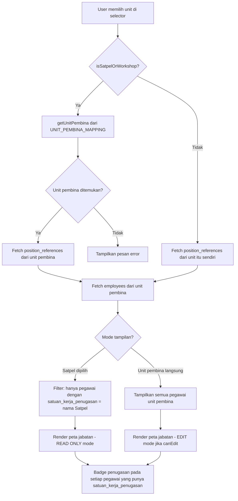

# Design Document: Satpel Peta Jabatan Induk

## Overview

Fitur ini menyelesaikan masalah tampilan kosong di halaman Peta Jabatan ketika unit yang dipilih adalah Satpel (Satuan Pelayanan) atau Workshop. Satpel tidak memiliki `position_references` sendiri — peta jabatan ASN-nya menginduk ke unit pembina (BBPVP/BPVP). Solusinya adalah:

1. **Redirect transparan**: Ketika Satpel dipilih, sistem secara otomatis mengambil `position_references` dari unit pembinanya.
2. **Badge penugasan**: Pegawai yang bertugas di Satpel tertentu ditandai dengan badge visual di peta jabatan unit pembina.
3. **Field baru di database**: Kolom `satuan_kerja_penugasan` di tabel `employees` menyimpan nama Satpel tempat pegawai bertugas secara fisik.
4. **Read-only mode**: Saat menampilkan peta jabatan Satpel, tombol tambah/edit/hapus jabatan dinonaktifkan karena pengelolaan jabatan ada di unit pembina.

### Prinsip Desain Utama

- **Tidak ada perubahan pada `department` pegawai**: Pegawai yang bertugas di Satpel tetap ber-`department` = nama unit pembina. Field `satuan_kerja_penugasan` adalah field tambahan, bukan pengganti `department`.
- **UNIT_PEMBINA_MAPPING sebagai single source of truth**: Semua logika resolusi unit pembina mengacu pada konstanta ini di `constants.ts`.
- **Backward compatible**: Unit pembina yang membuka peta jabatannya sendiri tidak mengalami perubahan perilaku — semua pegawai tetap ditampilkan, termasuk yang memiliki `satuan_kerja_penugasan`.

---

## Architecture



### Komponen yang Dimodifikasi

| Komponen | Perubahan |
|---|---|
| `src/pages/PetaJabatan.tsx` | Logika resolusi unit pembina, filter pegawai, read-only mode, badge rendering |
| `src/components/employees/EmployeeFormModal.tsx` | Tambah field `satuan_kerja_penugasan` dengan dropdown |
| `src/lib/constants.ts` | Tambah helper `getEffectiveDepartment` |
| `supabase/migrations/` | Migration baru untuk kolom `satuan_kerja_penugasan` |

---

## Components and Interfaces

### 1. Helper Functions di `constants.ts`

Tambahkan fungsi baru di `src/lib/constants.ts`:

```typescript
/**
 * Get the effective department for fetching position_references.
 * For Satpel/Workshop: returns the unit pembina.
 * For regular units: returns the unit itself.
 * Returns null if Satpel is not found in UNIT_PEMBINA_MAPPING.
 */
export function getEffectiveDepartment(department: string): string | null {
  if (!isSatpelOrWorkshop(department)) {
    return department;
  }
  return getUnitPembina(department); // null jika tidak ditemukan di mapping
}

/**
 * Check if a department should be in read-only mode for position management.
 * Satpel/Workshop are always read-only because positions are managed by unit pembina.
 */
export function isPositionReadOnly(department: string): boolean {
  return isSatpelOrWorkshop(department);
}
```

### 2. Badge Penugasan Component

Buat komponen baru `src/components/employees/SatpelBadge.tsx`:

```typescript
interface SatpelBadgeProps {
  satpelName: string;
  className?: string;
}

export function SatpelBadge({ satpelName, className }: SatpelBadgeProps) {
  // Tampilkan badge dengan nama Satpel yang disingkat
  // Contoh: "Satpel Lampung" → badge "Satpel Lampung"
  return (
    <span
      className={cn(
        "inline-flex items-center px-1.5 py-0.5 rounded text-xs font-medium",
        "bg-amber-100 text-amber-800 border border-amber-200",
        className
      )}
    >
      {satpelName}
    </span>
  );
}
```

Warna amber dipilih karena:
- Berbeda dari badge status lain yang sudah ada (biru untuk ASN status, hijau untuk aktif)
- Memberikan kesan "penugasan sementara/tambahan" yang sesuai konteks
- Kontras cukup untuk aksesibilitas (WCAG AA)

### 3. Perubahan di `PetaJabatan.tsx`

#### State baru

```typescript
// Nama Satpel yang sedang ditampilkan (null jika unit pembina langsung)
const [activeSatpelFilter, setActiveSatpelFilter] = useState<string | null>(null);

// Nama unit pembina efektif yang digunakan untuk fetch data
const [effectiveDepartment, setEffectiveDepartment] = useState<string>('');

// Apakah mode read-only (Satpel dipilih)
const isReadOnlyMode = useMemo(() => {
  return isPositionReadOnly(selectedDepartment);
}, [selectedDepartment]);
```

#### Logika resolusi department

```typescript
// Computed: effective department dan satpel filter
useEffect(() => {
  const effective = getEffectiveDepartment(selectedDepartment);
  if (effective === null) {
    // Satpel tidak ditemukan di mapping
    setEffectiveDepartment('');
    setActiveSatpelFilter(null);
    return;
  }
  setEffectiveDepartment(effective);
  // Jika selectedDepartment adalah Satpel, set filter
  if (isSatpelOrWorkshop(selectedDepartment)) {
    setActiveSatpelFilter(selectedDepartment);
  } else {
    setActiveSatpelFilter(null);
  }
}, [selectedDepartment]);
```

#### Perubahan pada `fetchData`

Query `position_references` menggunakan `effectiveDepartment` (bukan `selectedDepartment`).

Query `employees` menggunakan `effectiveDepartment` untuk `department`, lalu difilter di client-side berdasarkan `activeSatpelFilter`:

```typescript
// Fetch employees dari unit pembina
const empQuery = supabase
  .from('employees')
  .select('id, name, front_title, back_title, nip, asn_status, rank_group, gender, 
           position_name, additional_position, department, satuan_kerja_penugasan,
           keterangan_formasi, keterangan_penempatan, keterangan_penugasan, keterangan_perubahan')
  .eq('is_active', true)
  .eq('department', effectiveDepartment)
  .or('asn_status.is.null,asn_status.neq.Non ASN');

// Filter di client-side berdasarkan activeSatpelFilter
const filteredEmployees = activeSatpelFilter
  ? (empRes.data || []).filter(emp => emp.satuan_kerja_penugasan === activeSatpelFilter)
  : (empRes.data || []);
```

#### Informasi banner untuk mode Satpel

```tsx
{isReadOnlyMode && effectiveDepartment && (
  <div className="flex items-center gap-2 p-3 bg-blue-50 border border-blue-200 rounded-lg text-sm text-blue-800">
    <Info className="h-4 w-4 flex-shrink-0" />
    <span>
      Peta jabatan untuk <strong>{selectedDepartment}</strong> menginduk ke{' '}
      <strong>{effectiveDepartment}</strong>. Pengelolaan jabatan dilakukan di unit pembina.
    </span>
  </div>
)}
```

#### Disable tombol edit saat read-only

```tsx
// Tombol Tambah Jabatan
<Button
  onClick={openAddModal}
  disabled={isReadOnlyMode || !canEdit}
>
  <Plus className="h-4 w-4 mr-2" />
  Tambah Jabatan
</Button>

// Tombol Edit/Hapus per baris jabatan
<DropdownMenuItem
  onClick={() => openEditModal(pos)}
  disabled={isReadOnlyMode}
>
  <Pencil className="h-4 w-4 mr-2" />
  Edit
</DropdownMenuItem>
```

#### Render badge di baris pegawai

```tsx
// Di dalam render baris pegawai
const fullName = [emp.front_title, emp.name, emp.back_title].filter(Boolean).join(' ');
return (
  <div className="flex flex-col gap-0.5">
    <span>{fullName}</span>
    {emp.satuan_kerja_penugasan && (
      <SatpelBadge satpelName={emp.satuan_kerja_penugasan} />
    )}
  </div>
);
```

### 4. Perubahan di `EmployeeFormModal.tsx`

#### Tambah field ke schema Zod

```typescript
const employeeSchema = z.object({
  // ... field yang sudah ada ...
  satuan_kerja_penugasan: z.string().optional().or(z.literal('')),
});
```

#### Tambah ke interface Employee

```typescript
interface Employee {
  // ... field yang sudah ada ...
  satuan_kerja_penugasan: string | null;
}
```

#### Dropdown selector di form

Field ini ditampilkan di tab "Data Utama", di bawah field `department`. Dropdown hanya menampilkan Satpel/Workshop yang merupakan binaan dari unit pembina pegawai:

```tsx
{/* Satuan Kerja Penugasan - hanya tampil jika unit pembina memiliki Satpel binaan */}
{satpelOptions.length > 0 && (
  <div className="space-y-2">
    <Label htmlFor="satuan_kerja_penugasan">
      Satuan Kerja Penugasan
      <span className="text-muted-foreground text-xs ml-1">(opsional)</span>
    </Label>
    <Select
      value={form.watch('satuan_kerja_penugasan') || ''}
      onValueChange={(val) => form.setValue('satuan_kerja_penugasan', val === '__none__' ? '' : val)}
    >
      <SelectTrigger>
        <SelectValue placeholder="Bertugas di unit pembina langsung" />
      </SelectTrigger>
      <SelectContent>
        <SelectItem value="__none__">— Bertugas di unit pembina langsung —</SelectItem>
        {satpelOptions.map(satpel => (
          <SelectItem key={satpel} value={satpel}>{satpel}</SelectItem>
        ))}
      </SelectContent>
    </Select>
    {/* Peringatan jika nilai tidak valid */}
    {invalidSatpelWarning && (
      <p className="text-sm text-amber-600">{invalidSatpelWarning}</p>
    )}
  </div>
)}
```

`satpelOptions` dihitung dari `getSatpelsByPembina(watchedDepartment)`.

---

## Data Models

### Migration SQL Baru

File: `supabase/migrations/20260510000000_add_satuan_kerja_penugasan.sql`

```sql
-- Add satuan_kerja_penugasan column to employees table
ALTER TABLE public.employees
ADD COLUMN IF NOT EXISTS satuan_kerja_penugasan VARCHAR(255) DEFAULT NULL;

-- Add comment for documentation
COMMENT ON COLUMN public.employees.satuan_kerja_penugasan IS 
'Nama Satpel/Workshop tempat pegawai secara fisik bertugas. NULL berarti bertugas langsung di unit pembina (department). Nilai harus sesuai dengan UNIT_PEMBINA_MAPPING di constants.ts.';

-- Add index for performance (filtering by satuan_kerja_penugasan in Peta Jabatan)
CREATE INDEX IF NOT EXISTS idx_employees_satuan_kerja_penugasan 
ON public.employees(satuan_kerja_penugasan) 
WHERE satuan_kerja_penugasan IS NOT NULL;

-- Add index for combined query (department + satuan_kerja_penugasan)
CREATE INDEX IF NOT EXISTS idx_employees_dept_satpel 
ON public.employees(department, satuan_kerja_penugasan) 
WHERE satuan_kerja_penugasan IS NOT NULL;
```

### Perubahan Schema Employees

| Kolom | Tipe | Default | Keterangan |
|---|---|---|---|
| `satuan_kerja_penugasan` | `VARCHAR(255)` | `NULL` | Nama Satpel/Workshop tempat bertugas. NULL = bertugas di unit pembina langsung. |

### Interface TypeScript yang Diperbarui

```typescript
// Di PetaJabatan.tsx
interface EmployeeMatch {
  id: string;
  name: string;
  front_title: string | null;
  back_title: string | null;
  nip?: string | null;
  asn_status?: string | null;
  rank_group?: string | null;
  gender: string | null;
  position_name?: string | null;
  additional_position?: string | null;
  department?: string | null;
  satuan_kerja_penugasan?: string | null; // BARU
  keterangan_formasi?: string | null;
  keterangan_penempatan?: string | null;
  keterangan_penugasan?: string | null;
  keterangan_perubahan?: string | null;
}
```

---

## Correctness Properties

*A property is a characteristic or behavior that should hold true across all valid executions of a system — essentially, a formal statement about what the system should do. Properties serve as the bridge between human-readable specifications and machine-verifiable correctness guarantees.*

### Property 1: Resolusi Department Efektif

*For any* nama unit dalam `UNIT_PEMBINA_MAPPING`, fungsi `getEffectiveDepartment` harus mengembalikan nama unit pembina yang sesuai. *For any* nama unit yang bukan Satpel/Workshop, fungsi harus mengembalikan nama unit itu sendiri.

**Validates: Requirements 1.1, 1.4, 4.1**

### Property 2: Read-Only Mode untuk Satpel

*For any* nama Satpel atau Workshop yang ada dalam `UNIT_PEMBINA_MAPPING`, fungsi `isPositionReadOnly` harus mengembalikan `true`. *For any* nama unit yang bukan Satpel/Workshop, fungsi harus mengembalikan `false`.

**Validates: Requirements 1.3, 4.3**

### Property 3: Filter Pegawai Satpel

*For any* daftar pegawai dan nama Satpel S, memfilter pegawai berdasarkan `satuan_kerja_penugasan === S` harus menghasilkan subset yang tepat: semua pegawai dalam hasil memiliki `satuan_kerja_penugasan === S`, dan tidak ada pegawai dengan `satuan_kerja_penugasan !== S` yang masuk ke hasil.

**Validates: Requirements 2.4, 4.2**

### Property 4: Badge Muncul Jika dan Hanya Jika Ada Penugasan

*For any* pegawai, badge penugasan harus muncul jika dan hanya jika `satuan_kerja_penugasan` tidak null dan tidak kosong. Nama yang ditampilkan di badge harus sama persis dengan nilai `satuan_kerja_penugasan`.

**Validates: Requirements 2.1, 2.2**

### Property 5: Validasi Satpel Binaan

*For any* unit pembina P dan nilai `satuan_kerja_penugasan` V, fungsi validasi harus menerima V jika dan hanya jika V ada dalam `getSatpelsByPembina(P)` atau V adalah null/kosong. Untuk V yang merupakan nama Satpel valid tapi bukan binaan P, validasi harus menolak.

**Validates: Requirements 3.2, 3.3, 3.5**

### Property 6: Konsistensi Department-Penugasan

*For any* pegawai dengan `satuan_kerja_penugasan` S yang tidak null, `department` pegawai tersebut harus sama dengan `UNIT_PEMBINA_MAPPING[S]`. Dengan kata lain, `getUnitPembina(satuan_kerja_penugasan) === department` harus selalu berlaku.

**Validates: Requirements 5.1**

### Property 7: Validasi Import — Nilai Tidak Valid Dikosongkan

*For any* baris data impor dengan nilai `satuan_kerja_penugasan` yang tidak ada dalam `UNIT_PEMBINA_MAPPING` (dan bukan null/kosong), fungsi validasi impor harus mengosongkan field tersebut dan menambahkan peringatan, bukan menyimpan nilai tidak valid.

**Validates: Requirements 5.2, 5.3**

---

## Error Handling

### Satpel Tidak Ditemukan di Mapping

Jika `selectedDepartment` adalah Satpel/Workshop tapi tidak ada di `UNIT_PEMBINA_MAPPING` (data tidak konsisten):

```tsx
{isSatpelOrWorkshop(selectedDepartment) && !effectiveDepartment && (
  <div className="flex items-center gap-2 p-4 bg-red-50 border border-red-200 rounded-lg">
    <AlertCircle className="h-5 w-5 text-red-600" />
    <div>
      <p className="font-medium text-red-800">Unit pembina tidak ditemukan</p>
      <p className="text-sm text-red-600">
        Unit <strong>{selectedDepartment}</strong> tidak memiliki unit pembina yang terdaftar. 
        Hubungi admin pusat untuk konfigurasi.
      </p>
    </div>
  </div>
)}
```

### Validasi Form — Satpel Bukan Binaan

Saat admin memilih `satuan_kerja_penugasan` yang bukan binaan dari unit pembina pegawai:

```typescript
// Di EmployeeFormModal.tsx
const validateSatpelPenugasan = (value: string, pembinaDept: string): string | null => {
  if (!value) return null; // null/kosong selalu valid
  const validSatpels = getSatpelsByPembina(pembinaDept);
  if (!validSatpels.includes(value)) {
    return `${value} bukan binaan dari ${pembinaDept}. Pilih Satpel yang sesuai.`;
  }
  return null;
};
```

### Fetch Error

Error saat fetch data ditangani dengan toast notification yang sudah ada. Tidak ada perubahan pada error handling fetch.

---

## Testing Strategy

### Unit Tests (Vitest)

Fokus pada fungsi-fungsi helper murni yang bisa diuji tanpa database:

1. `getEffectiveDepartment` — semua Satpel dalam mapping, unit non-Satpel, Satpel tidak dikenal
2. `isPositionReadOnly` — semua Satpel/Workshop, unit pembina, unit lain
3. `validateSatpelPenugasan` — nilai valid, nilai tidak valid, null/kosong
4. Filter logic `filterEmployeesForSatpel` — subset yang benar, tidak ada false positive/negative

### Property-Based Tests (fast-check)

Menggunakan library [fast-check](https://fast-check.io/) untuk TypeScript. Setiap property test dikonfigurasi minimum 100 iterasi.

**Property 1 — Resolusi Department Efektif:**
```typescript
// Feature: satpel-peta-jabatan-induk, Property 1: Resolusi Department Efektif
it('getEffectiveDepartment returns unit pembina for any Satpel in mapping', () => {
  const satpelNames = Object.keys(UNIT_PEMBINA_MAPPING);
  fc.assert(
    fc.property(fc.constantFrom(...satpelNames), (satpel) => {
      const result = getEffectiveDepartment(satpel);
      return result === UNIT_PEMBINA_MAPPING[satpel];
    }),
    { numRuns: 100 }
  );
});

it('getEffectiveDepartment returns unit itself for non-Satpel', () => {
  const nonSatpelUnits = DEPARTMENTS.filter(d => !isSatpelOrWorkshop(d));
  fc.assert(
    fc.property(fc.constantFrom(...nonSatpelUnits), (dept) => {
      return getEffectiveDepartment(dept) === dept;
    }),
    { numRuns: 100 }
  );
});
```

**Property 2 — Read-Only Mode:**
```typescript
// Feature: satpel-peta-jabatan-induk, Property 2: Read-Only Mode untuk Satpel
it('isPositionReadOnly returns true for any Satpel/Workshop', () => {
  const satpelNames = Object.keys(UNIT_PEMBINA_MAPPING);
  fc.assert(
    fc.property(fc.constantFrom(...satpelNames), (satpel) => {
      return isPositionReadOnly(satpel) === true;
    }),
    { numRuns: 100 }
  );
});
```

**Property 3 — Filter Pegawai Satpel:**
```typescript
// Feature: satpel-peta-jabatan-induk, Property 3: Filter Pegawai Satpel
it('filterEmployeesForSatpel returns only employees with matching satuan_kerja_penugasan', () => {
  const satpelNames = Object.keys(UNIT_PEMBINA_MAPPING);
  const employeeArb = fc.record({
    id: fc.uuid(),
    name: fc.string({ minLength: 3 }),
    satuan_kerja_penugasan: fc.option(fc.constantFrom(...satpelNames), { nil: null }),
  });
  
  fc.assert(
    fc.property(
      fc.array(employeeArb, { minLength: 0, maxLength: 50 }),
      fc.constantFrom(...satpelNames),
      (employees, targetSatpel) => {
        const filtered = employees.filter(e => e.satuan_kerja_penugasan === targetSatpel);
        // Semua hasil harus memiliki satuan_kerja_penugasan yang benar
        return filtered.every(e => e.satuan_kerja_penugasan === targetSatpel);
      }
    ),
    { numRuns: 100 }
  );
});
```

**Property 4 — Badge Rendering:**
```typescript
// Feature: satpel-peta-jabatan-induk, Property 4: Badge Muncul Jika dan Hanya Jika Ada Penugasan
it('badge appears iff satuan_kerja_penugasan is non-null and non-empty', () => {
  const satpelNames = Object.keys(UNIT_PEMBINA_MAPPING);
  fc.assert(
    fc.property(
      fc.option(fc.constantFrom(...satpelNames), { nil: null }),
      (satpelValue) => {
        const shouldShowBadge = satpelValue !== null && satpelValue !== '';
        // Verifikasi logika kondisi badge
        const actuallyShowsBadge = Boolean(satpelValue);
        return shouldShowBadge === actuallyShowsBadge;
      }
    ),
    { numRuns: 100 }
  );
});
```

**Property 5 — Validasi Satpel Binaan:**
```typescript
// Feature: satpel-peta-jabatan-induk, Property 5: Validasi Satpel Binaan
it('validateSatpelPenugasan accepts only valid Satpel for given pembina', () => {
  const pembinaUnits = [...new Set(Object.values(UNIT_PEMBINA_MAPPING))];
  fc.assert(
    fc.property(
      fc.constantFrom(...pembinaUnits),
      fc.constantFrom(...Object.keys(UNIT_PEMBINA_MAPPING)),
      (pembina, satpel) => {
        const isValidForPembina = UNIT_PEMBINA_MAPPING[satpel] === pembina;
        const validationResult = validateSatpelPenugasan(satpel, pembina);
        // Jika valid untuk pembina ini, tidak ada error
        // Jika tidak valid, harus ada error message
        if (isValidForPembina) {
          return validationResult === null;
        } else {
          return validationResult !== null;
        }
      }
    ),
    { numRuns: 100 }
  );
});
```

**Property 6 — Konsistensi Department-Penugasan:**
```typescript
// Feature: satpel-peta-jabatan-induk, Property 6: Konsistensi Department-Penugasan
it('for any employee with satuan_kerja_penugasan, department must be the unit pembina', () => {
  const satpelNames = Object.keys(UNIT_PEMBINA_MAPPING);
  fc.assert(
    fc.property(
      fc.constantFrom(...satpelNames),
      (satpel) => {
        const expectedDepartment = UNIT_PEMBINA_MAPPING[satpel];
        // Invariant: getUnitPembina(satuan_kerja_penugasan) === department
        return getUnitPembina(satpel) === expectedDepartment;
      }
    ),
    { numRuns: 100 }
  );
});
```

**Property 7 — Validasi Import:**
```typescript
// Feature: satpel-peta-jabatan-induk, Property 7: Validasi Import — Nilai Tidak Valid Dikosongkan
it('import validation clears invalid satuan_kerja_penugasan values', () => {
  const validSatpels = new Set(Object.keys(UNIT_PEMBINA_MAPPING));
  fc.assert(
    fc.property(
      fc.string({ minLength: 1, maxLength: 50 }).filter(s => !validSatpels.has(s)),
      (invalidValue) => {
        const result = validateImportSatpelPenugasan(invalidValue);
        // Nilai tidak valid harus dikosongkan (null/empty) dan ada warning
        return result.value === null && result.warning !== null;
      }
    ),
    { numRuns: 100 }
  );
});
```

### Integration Tests

- Verifikasi kolom `satuan_kerja_penugasan` ada di tabel `employees` (smoke test schema)
- Verifikasi RLS policy tidak memblokir akses ke field baru
- End-to-end: admin Satpel membuka Peta Jabatan → data unit pembina muncul dengan filter yang benar
