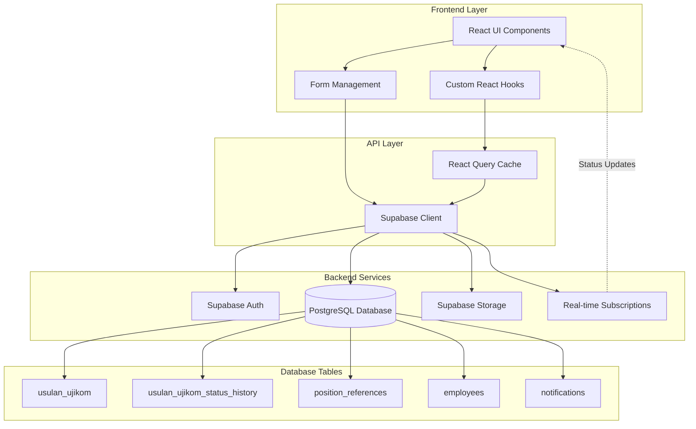
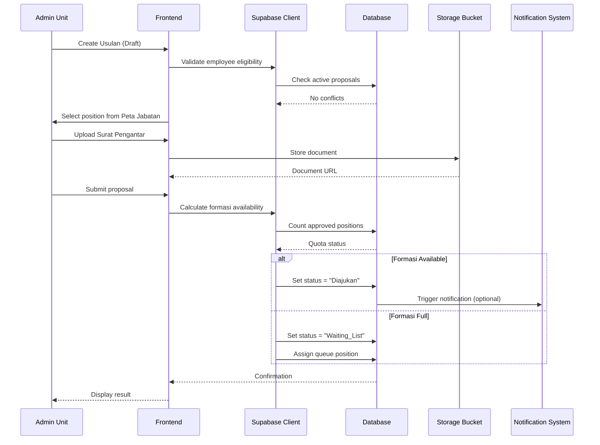
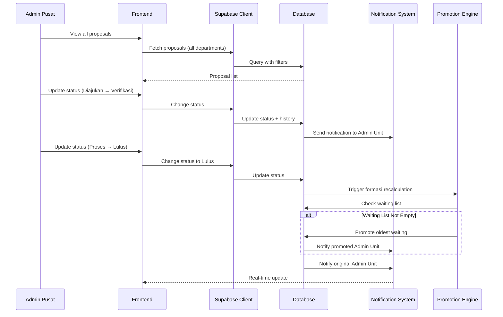
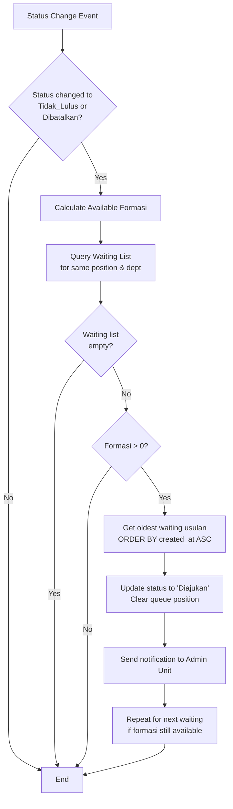
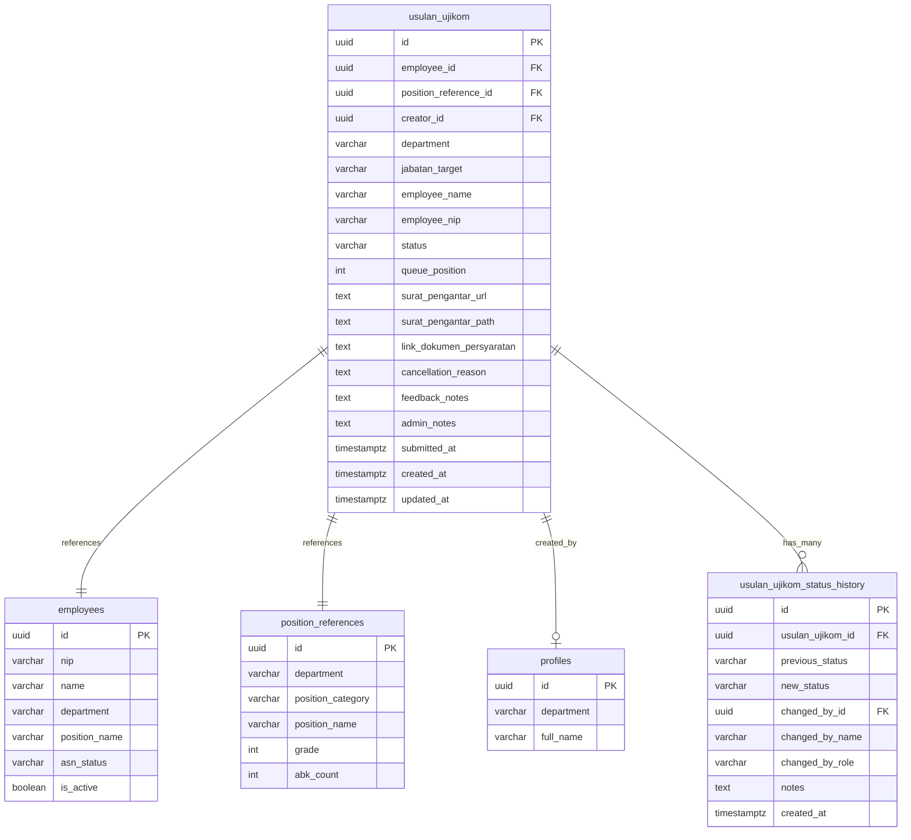

# Design Document: Usulan Ujikom Pegawai

## Overview

The Usulan Ujikom Pegawai (Employee Competency Test Proposal) system is a comprehensive workflow management feature that enables Admin Unit to propose employees for competency testing (ujikom) for functional position promotions, while Admin Pusat manages the entire verification and approval process. The system integrates with the existing Peta Jabatan (Position Map) to validate position quotas and implements an intelligent waiting list with automatic promotion when positions become available.

### Key Features

1. **Proposal Creation & Management**: Admin Unit can create, edit, and cancel employee competency test proposals
2. **Peta Jabatan Integration**: Real-time validation of available position quotas (formasi) based on `position_references` table
3. **Intelligent Waiting List**: Automatic queuing when positions are full, with FIFO promotion when slots open
4. **Complete Workflow Management**: Eight-state workflow from Draft to final results (Lulus/Tidak Lulus)
5. **Document Management**: Upload and storage of required documents (Surat Pengantar, supporting documents)
6. **Admin Pusat Processing**: Full verification, testing, and result management capabilities
7. **Real-time Notifications**: Status change notifications for Admin Unit
8. **Audit Trail**: Complete history tracking of all status changes

### Technology Stack

- **Frontend**: React 18 with TypeScript, Vite build tool
- **UI Framework**: Radix UI components with shadcn/ui, Tailwind CSS
- **Backend**: Supabase (PostgreSQL database, authentication, storage, real-time subscriptions)
- **State Management**: TanStack Query (React Query) for server state
- **Form Management**: React Hook Form with Zod validation
- **Routing**: React Router v6

### Integration Points

- **Peta Jabatan**: Reads `position_references` table to validate formasi availability
- **Employee System**: References `employees` table for eligible employee selection
- **Notification System**: Uses existing `notifications` table for status updates
- **Supabase Storage**: Stores uploaded documents in organized bucket structure

## Architecture

### System Architecture



### Application Flow

#### Admin Unit Workflow



#### Admin Pusat Workflow



#### Automatic Promotion Logic



### Component Architecture

The frontend will follow the existing project structure with these main components:

```
src/
├── pages/
│   ├── UsulanUjikom.tsx              # Admin Unit main page
│   └── UsulanUjikomPusat.tsx         # Admin Pusat management page
├── components/
│   └── usulan-ujikom/
│       ├── UsulanForm.tsx            # Create/Edit form
│       ├── UsulanList.tsx            # List view with filters
│       ├── UsulanDetail.tsx          # Detail view modal/page
│       ├── PetaJabatanSelector.tsx   # Position selection from Peta Jabatan
│       ├── EmployeeSelector.tsx      # Employee search and selection
│       ├── DocumentUpload.tsx        # Document upload component
│       ├── StatusBadge.tsx           # Status display component
│       ├── StatusHistory.tsx         # Status history timeline
│       └── WaitingListQueue.tsx      # Queue position display
├── hooks/
│   ├── useUsulanUjikom.ts           # Main data hook
│   ├── useUsulanUjikomMutations.ts  # Create/Update/Delete
│   ├── useFormasi.ts                 # Formasi calculation
│   └── useUsulanNotifications.ts    # Notification subscriptions
└── lib/
    ├── usulan-ujikom-storage.ts     # API functions
    ├── usulan-ujikom-types.ts       # TypeScript types
    └── usulan-ujikom-validation.ts  # Zod schemas
```

## Components and Interfaces

### Database Schema

#### Main Table: `usulan_ujikom`

```sql
CREATE TABLE public.usulan_ujikom (
  id UUID PRIMARY KEY DEFAULT gen_random_uuid(),
  
  -- Foreign Keys
  employee_id UUID NOT NULL REFERENCES public.employees(id) ON DELETE RESTRICT,
  position_reference_id UUID NOT NULL REFERENCES public.position_references(id) ON DELETE RESTRICT,
  creator_id UUID NOT NULL REFERENCES auth.users(id) ON DELETE SET NULL,
  
  -- Proposal Information
  department VARCHAR(255) NOT NULL,
  jabatan_target VARCHAR(255) NOT NULL,  -- Denormalized for quick access
  employee_name VARCHAR(255) NOT NULL,    -- Denormalized for quick access
  employee_nip VARCHAR(18),               -- Denormalized for quick access
  
  -- Status and Workflow
  status VARCHAR(50) NOT NULL DEFAULT 'Draft',
  queue_position INTEGER,  -- Only filled when status = 'Waiting_List'
  
  -- Documents
  surat_pengantar_url TEXT,  -- Supabase Storage URL
  surat_pengantar_path TEXT, -- Storage path for deletion
  link_dokumen_persyaratan TEXT,  -- External URL (Google Drive, etc.)
  
  -- Admin Pusat Actions
  cancellation_reason TEXT,  -- Required when status = 'Dibatalkan'
  feedback_notes TEXT,       -- Optional feedback for 'Tidak_Lulus_Ujikom'
  admin_notes TEXT,          -- General notes by Admin Pusat
  
  -- Metadata
  submitted_at TIMESTAMPTZ,  -- When status changed from Draft to Diajukan/Waiting
  created_at TIMESTAMPTZ DEFAULT now(),
  updated_at TIMESTAMPTZ DEFAULT now(),
  
  -- Constraints
  CONSTRAINT valid_status CHECK (status IN (
    'Draft', 'Waiting_List', 'Diajukan', 'Verifikasi_Berkas',
    'Proses_Ujikom', 'Lulus_Ujikom', 'Tidak_Lulus_Ujikom', 'Dibatalkan'
  )),
  CONSTRAINT queue_position_required CHECK (
    (status = 'Waiting_List' AND queue_position IS NOT NULL) OR
    (status != 'Waiting_List' AND queue_position IS NULL)
  ),
  CONSTRAINT cancellation_reason_required CHECK (
    (status = 'Dibatalkan' AND cancellation_reason IS NOT NULL) OR
    (status != 'Dibatalkan')
  )
);

-- Indexes for performance
CREATE INDEX idx_usulan_ujikom_employee ON public.usulan_ujikom(employee_id);
CREATE INDEX idx_usulan_ujikom_position ON public.usulan_ujikom(position_reference_id);
CREATE INDEX idx_usulan_ujikom_department ON public.usulan_ujikom(department);
CREATE INDEX idx_usulan_ujikom_status ON public.usulan_ujikom(status);
CREATE INDEX idx_usulan_ujikom_waiting_queue ON public.usulan_ujikom(position_reference_id, status, queue_position) 
  WHERE status = 'Waiting_List';
CREATE INDEX idx_usulan_ujikom_submitted ON public.usulan_ujikom(submitted_at DESC);

-- Trigger for updated_at
CREATE TRIGGER update_usulan_ujikom_updated_at
  BEFORE UPDATE ON public.usulan_ujikom
  FOR EACH ROW EXECUTE FUNCTION public.update_updated_at_column();
```

#### Audit Table: `usulan_ujikom_status_history`

```sql
CREATE TABLE public.usulan_ujikom_status_history (
  id UUID PRIMARY KEY DEFAULT gen_random_uuid(),
  usulan_ujikom_id UUID NOT NULL REFERENCES public.usulan_ujikom(id) ON DELETE CASCADE,
  
  -- Status Change
  previous_status VARCHAR(50),
  new_status VARCHAR(50) NOT NULL,
  
  -- Actor Information
  changed_by_id UUID REFERENCES auth.users(id) ON DELETE SET NULL,
  changed_by_name VARCHAR(255),
  changed_by_role VARCHAR(50),
  
  -- Additional Information
  notes TEXT,  -- Cancellation reason or feedback notes
  
  -- Timestamp
  created_at TIMESTAMPTZ DEFAULT now(),
  
  -- Constraints
  CONSTRAINT valid_previous_status CHECK (previous_status IN (
    'Draft', 'Waiting_List', 'Diajukan', 'Verifikasi_Berkas',
    'Proses_Ujikom', 'Lulus_Ujikom', 'Tidak_Lulus_Ujikom', 'Dibatalkan'
  )),
  CONSTRAINT valid_new_status CHECK (new_status IN (
    'Draft', 'Waiting_List', 'Diajukan', 'Verifikasi_Berkas',
    'Proses_Ujikom', 'Lulus_Ujikom', 'Tidak_Lulus_Ujikom', 'Dibatalkan'
  ))
);

-- Index for retrieving history
CREATE INDEX idx_status_history_usulan ON public.usulan_ujikom_status_history(usulan_ujikom_id, created_at DESC);
```

### Row Level Security (RLS) Policies

```sql
-- Enable RLS
ALTER TABLE public.usulan_ujikom ENABLE ROW LEVEL SECURITY;
ALTER TABLE public.usulan_ujikom_status_history ENABLE ROW LEVEL SECURITY;

-- Admin Pusat can manage all usulan
CREATE POLICY "Admin pusat can manage all usulan"
  ON public.usulan_ujikom FOR ALL
  TO public
  USING (public.has_role(auth.uid(), 'admin_pusat'));

-- Admin Unit can view their department's usulan
CREATE POLICY "Admin unit can view own department usulan"
  ON public.usulan_ujikom FOR SELECT
  TO public
  USING (
    public.has_role(auth.uid(), 'admin_unit') 
    AND department = public.get_user_department(auth.uid())
  );

-- Admin Unit can create usulan for their department
CREATE POLICY "Admin unit can create own department usulan"
  ON public.usulan_ujikom FOR INSERT
  TO public
  WITH CHECK (
    public.has_role(auth.uid(), 'admin_unit') 
    AND department = public.get_user_department(auth.uid())
    AND creator_id = auth.uid()
  );

-- Admin Unit can update Draft and Waiting_List usulan they created
CREATE POLICY "Admin unit can update draft and waiting usulan"
  ON public.usulan_ujikom FOR UPDATE
  TO public
  USING (
    public.has_role(auth.uid(), 'admin_unit') 
    AND department = public.get_user_department(auth.uid())
    AND creator_id = auth.uid()
    AND status IN ('Draft', 'Waiting_List')
  );

-- Admin Unit can delete Draft usulan they created
CREATE POLICY "Admin unit can delete draft usulan"
  ON public.usulan_ujikom FOR DELETE
  TO public
  USING (
    public.has_role(auth.uid(), 'admin_unit') 
    AND department = public.get_user_department(auth.uid())
    AND creator_id = auth.uid()
    AND status = 'Draft'
  );

-- Status history policies
CREATE POLICY "Admin pusat can view all status history"
  ON public.usulan_ujikom_status_history FOR SELECT
  TO public
  USING (public.has_role(auth.uid(), 'admin_pusat'));

CREATE POLICY "Admin unit can view own department status history"
  ON public.usulan_ujikom_status_history FOR SELECT
  TO public
  USING (
    public.has_role(auth.uid(), 'admin_unit') 
    AND EXISTS (
      SELECT 1 FROM public.usulan_ujikom u
      WHERE u.id = usulan_ujikom_id
      AND u.department = public.get_user_department(auth.uid())
    )
  );

CREATE POLICY "Authenticated can insert status history"
  ON public.usulan_ujikom_status_history FOR INSERT
  TO authenticated
  WITH CHECK (true);
```

### TypeScript Interfaces

```typescript
// Main Usulan Type
export interface UsulanUjikom {
  id: string;
  employee_id: string;
  position_reference_id: string;
  creator_id: string;
  department: string;
  jabatan_target: string;
  employee_name: string;
  employee_nip: string | null;
  status: UsulanStatus;
  queue_position: number | null;
  surat_pengantar_url: string | null;
  surat_pengantar_path: string | null;
  link_dokumen_persyaratan: string | null;
  cancellation_reason: string | null;
  feedback_notes: string | null;
  admin_notes: string | null;
  submitted_at: string | null;
  created_at: string;
  updated_at: string;
  
  // Joined data (for display)
  employee?: Employee;
  position_reference?: PositionReference;
  creator?: Profile;
}

// Status Type
export type UsulanStatus =
  | 'Draft'
  | 'Waiting_List'
  | 'Diajukan'
  | 'Verifikasi_Berkas'
  | 'Proses_Ujikom'
  | 'Lulus_Ujikom'
  | 'Tidak_Lulus_Ujikom'
  | 'Dibatalkan';

// Status History
export interface UsulanStatusHistory {
  id: string;
  usulan_ujikom_id: string;
  previous_status: UsulanStatus | null;
  new_status: UsulanStatus;
  changed_by_id: string | null;
  changed_by_name: string | null;
  changed_by_role: string | null;
  notes: string | null;
  created_at: string;
}

// Form Data Types
export interface UsulanFormData {
  employee_id: string;
  position_reference_id: string;
  link_dokumen_persyaratan: string;
  surat_pengantar_file: File | null;
}

export interface UsulanUpdateData {
  employee_id?: string;
  position_reference_id?: string;
  link_dokumen_persyaratan?: string;
  surat_pengantar_file?: File | null;
}

export interface StatusChangeData {
  new_status: UsulanStatus;
  notes?: string;  // cancellation_reason, feedback_notes, or admin_notes
}

// Formasi Calculation
export interface FormasiInfo {
  position_reference_id: string;
  position_name: string;
  department: string;
  abk_count: number;
  occupied_count: number;
  available_count: number;
  is_full: boolean;
}

// Waiting List Info
export interface WaitingListInfo {
  usulan_id: string;
  queue_position: number;
  employee_name: string;
  submitted_at: string;
}
```

### Zod Validation Schemas

```typescript
import { z } from 'zod';

export const usulanFormSchema = z.object({
  employee_id: z.string().uuid('ID pegawai tidak valid'),
  position_reference_id: z.string().uuid('ID jabatan tidak valid'),
  link_dokumen_persyaratan: z
    .string()
    .url('Link dokumen harus berupa URL yang valid')
    .min(1, 'Link dokumen wajib diisi'),
  surat_pengantar_file: z
    .instanceof(File)
    .refine((file) => file.size <= 5 * 1024 * 1024, 'Ukuran file maksimal 5MB')
    .refine(
      (file) => ['application/pdf', 'image/jpeg', 'image/png'].includes(file.type),
      'Format file harus PDF, JPG, atau PNG'
    )
});

export const usulanUpdateSchema = usulanFormSchema.partial();

export const statusChangeSchema = z.object({
  new_status: z.enum([
    'Draft', 'Waiting_List', 'Diajukan', 'Verifikasi_Berkas',
    'Proses_Ujikom', 'Lulus_Ujikom', 'Tidak_Lulus_Ujikom', 'Dibatalkan'
  ]),
  notes: z.string().optional()
});

export const cancellationSchema = z.object({
  new_status: z.literal('Dibatalkan'),
  notes: z.string().min(10, 'Alasan pembatalan minimal 10 karakter')
});

export const feedbackSchema = z.object({
  new_status: z.literal('Tidak_Lulus_Ujikom'),
  notes: z.string().optional()
});
```

## Data Models

### Entity Relationship Diagram



### Formasi Calculation Logic

The formasi (position quota) calculation is critical for determining whether a proposal goes to "Diajukan" or "Waiting_List":

```typescript
/**
 * Calculate available formasi for a specific position and department
 */
async function calculateFormasi(
  positionReferenceId: string,
  department: string
): Promise<FormasiInfo> {
  // 1. Get ABK count from position_references
  const { data: positionRef, error: posError } = await supabase
    .from('position_references')
    .select('position_name, abk_count')
    .eq('id', positionReferenceId)
    .single();
  
  if (posError || !positionRef) {
    throw new Error('Position not found');
  }
  
  // 2. Count occupied positions (status = 'Lulus_Ujikom')
  const { count: occupiedCount, error: countError } = await supabase
    .from('usulan_ujikom')
    .select('*', { count: 'exact', head: true })
    .eq('position_reference_id', positionReferenceId)
    .eq('department', department)
    .eq('status', 'Lulus_Ujikom');
  
  if (countError) {
    throw new Error('Failed to count occupied positions');
  }
  
  const abkCount = positionRef.abk_count || 0;
  const occupied = occupiedCount || 0;
  const available = Math.max(0, abkCount - occupied);
  
  return {
    position_reference_id: positionReferenceId,
    position_name: positionRef.position_name,
    department,
    abk_count: abkCount,
    occupied_count: occupied,
    available_count: available,
    is_full: available === 0
  };
}
```

### Automatic Promotion Algorithm

When a usulan status changes to "Tidak_Lulus_Ujikom" or "Dibatalkan", the system triggers automatic promotion:

```typescript
/**
 * Promote waiting usulan when formasi becomes available
 */
async function promoteFromWaitingList(
  positionReferenceId: string,
  department: string
): Promise<void> {
  // 1. Check if formasi is available
  const formasiInfo = await calculateFormasi(positionReferenceId, department);
  
  if (formasiInfo.available_count <= 0) {
    return; // No available formasi
  }
  
  // 2. Get waiting usulan ordered by submission time (FIFO)
  const { data: waitingUsulan, error } = await supabase
    .from('usulan_ujikom')
    .select('id, employee_name, creator_id, department')
    .eq('position_reference_id', positionReferenceId)
    .eq('department', department)
    .eq('status', 'Waiting_List')
    .order('submitted_at', { ascending: true })
    .limit(formasiInfo.available_count);
  
  if (error || !waitingUsulan || waitingUsulan.length === 0) {
    return; // No waiting usulan
  }
  
  // 3. Promote each usulan
  for (const usulan of waitingUsulan) {
    await supabase
      .from('usulan_ujikom')
      .update({
        status: 'Diajukan',
        queue_position: null,
        updated_at: new Date().toISOString()
      })
      .eq('id', usulan.id);
    
    // 4. Record status change in history
    await supabase
      .from('usulan_ujikom_status_history')
      .insert({
        usulan_ujikom_id: usulan.id,
        previous_status: 'Waiting_List',
        new_status: 'Diajukan',
        changed_by_id: null, // System action
        changed_by_name: 'System',
        changed_by_role: 'system',
        notes: 'Automatically promoted from waiting list'
      });
    
    // 5. Send notification to Admin Unit
    await supabase
      .from('notifications')
      .insert({
        recipient_role: 'admin_unit',
        recipient_department: usulan.department,
        type: 'usulan_ujikom_status_change',
        title: 'Usulan Dipromosikan',
        message: `Usulan ujikom untuk ${usulan.employee_name} telah dipromosikan dari Waiting List ke Diajukan`,
        actor_id: null,
        actor_name: 'System',
        is_read: false
      });
  }
  
  // 6. Reorder remaining waiting list
  await reorderWaitingList(positionReferenceId, department);
}

/**
 * Reorder queue positions after promotion
 */
async function reorderWaitingList(
  positionReferenceId: string,
  department: string
): Promise<void> {
  const { data: remaining, error } = await supabase
    .from('usulan_ujikom')
    .select('id')
    .eq('position_reference_id', positionReferenceId)
    .eq('department', department)
    .eq('status', 'Waiting_List')
    .order('submitted_at', { ascending: true });
  
  if (error || !remaining) return;
  
  for (let i = 0; i < remaining.length; i++) {
    await supabase
      .from('usulan_ujikom')
      .update({ queue_position: i + 1 })
      .eq('id', remaining[i].id);
  }
}
```

### Storage Organization

Supabase Storage bucket structure for documents:

```
usulan-ujikom/
├── {usulan_id}/
│   └── surat-pengantar/
│       └── {filename}.{ext}
```

Storage policy:

```sql
-- Create storage bucket
INSERT INTO storage.buckets (id, name, public) 
VALUES ('usulan-ujikom', 'usulan-ujikom', false);

-- Admin Pusat can access all files
CREATE POLICY "Admin pusat can access all files"
ON storage.objects FOR ALL
TO public
USING (
  bucket_id = 'usulan-ujikom'
  AND public.has_role(auth.uid(), 'admin_pusat')
);

-- Admin Unit can upload to their department's folders
CREATE POLICY "Admin unit can upload own department files"
ON storage.objects FOR INSERT
TO public
WITH CHECK (
  bucket_id = 'usulan-ujikom'
  AND public.has_role(auth.uid(), 'admin_unit')
  AND EXISTS (
    SELECT 1 FROM public.usulan_ujikom u
    WHERE u.id::text = (storage.foldername(name))[1]
    AND u.department = public.get_user_department(auth.uid())
    AND u.creator_id = auth.uid()
  )
);

-- Admin Unit can view their department's files
CREATE POLICY "Admin unit can view own department files"
ON storage.objects FOR SELECT
TO public
USING (
  bucket_id = 'usulan-ujikom'
  AND public.has_role(auth.uid(), 'admin_unit')
  AND EXISTS (
    SELECT 1 FROM public.usulan_ujikom u
    WHERE u.id::text = (storage.foldername(name))[1]
    AND u.department = public.get_user_department(auth.uid())
  )
);
```

